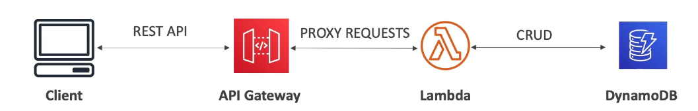

# Amazon API Gateway

Fully managed service for developers to easily create, publish, maintain, monitor and secure APIs

- serverless and scalable

## Use Case: Building a serverless API

- Our Lambda function is doing CRUD operations on DynamoDB
- We want external clients to be able to access the Lambda function, but it is not exposed as an API.
- We can expose it by using an API Gateway, which provodes the client with a REST API and Proxy the requests to the Lambda function.