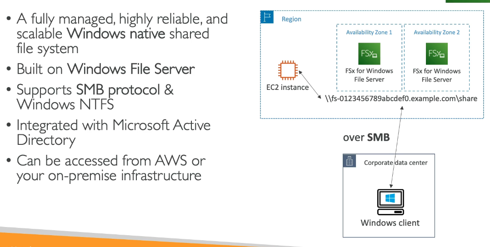
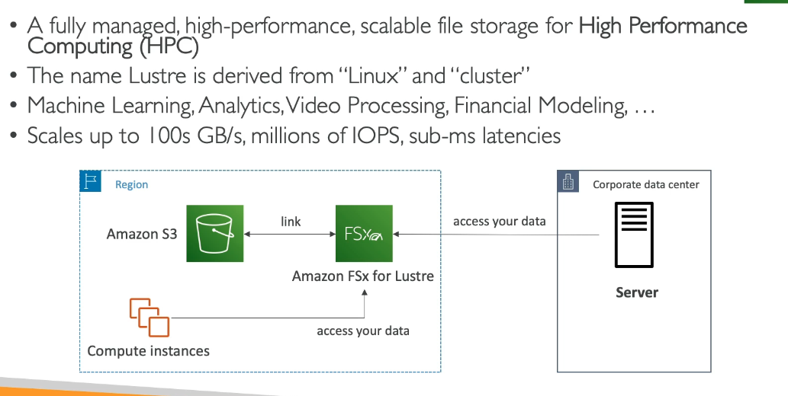

# Amazon FSx

A way to launch 3rd party high-performance file systems on AWS.

- Manages the file systems

Three offerings:

1. FSx for Lustre
2. FSx for Windows File Server
3. FSx for Net App ONTAP

## FSx for Windows File Server

Made for Windows instances

## Amazon FSx for Lustre

Storage for High Performance Computing

