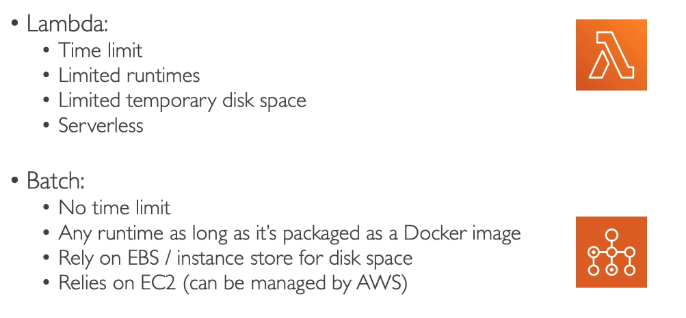

# AWS Batch

- Fully managed batch processing at any scale (not serverless but managed)
- Can efficiently run 100,000s of computing batch jobs on AWS
- A "batch" job is a job with a start and an end (opposed to continuous/streamung job that doesn't end).
- Batch jobs are defined as docker images that run on ECS.
- Batch will dynamically launch EC2 instances or Spot instances to run the jobs.
- AWS Batch provisions the right amount of compute/ memory
- Just submit or schedule batch jobs to the queu and AWS Batch will do the rest
- Helpful for cost optimisation and focusing less on the infrastructure.

## Batch vs Lambda

