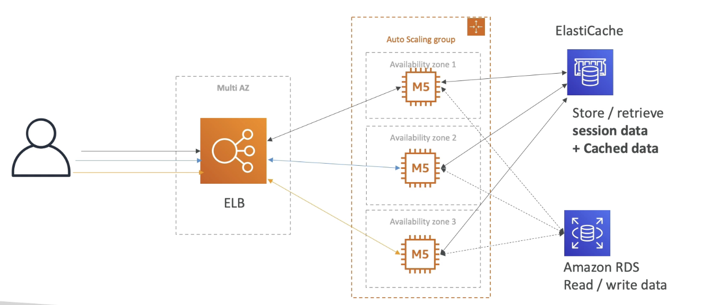
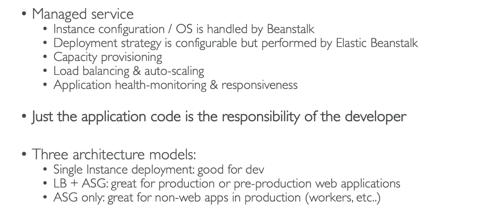

# AWS Beanstalk

## 3-tier Architecture

- The user talks to the Elastic Load balancer which talks to the EC2 instances which are managed by an auto scaling group.
- The data is stored in a database to read and write data e.g. Amazon RDS
- In memory database/cache to store and retrieve the session data e.g. Elasticache

This architecture can be produced manually or through CloudFormation, but the best way is Elastic Beanstalk.

## Elastic Beanstalk

Elastic Beanstalk = Platform as a Service, because we just worry about the code.

- a developer centric view of deploying an application on AWS (very simple).
- Uses all the components we need e.g. EC2, ASG but it is all in one place that it easy to make sense of.
- We also still have full control over the configuration
- Supports many plaforms e.g. Java, Python, Ruby, Docker
- The resources are actually created by CloudFormation.

- Beanstalk has a full monitoring within the service itself.
- A health agent on every instance that pushes metrics to CloudWatch and can monitor within the service itself.

# Steps
1. Elastic Beanstalk
2. Create application
3. Web server environment
4. Name
5. Environment name
6. Domain name is automatically generated
7. Managed platform
8. Platform e.g. Java
9. Next
10. New service role
11. EC2 instance profile
    1.  Go into IAM
    2.  Roles
    3.  Create role
    4.  AWS service
    5.  Ec2
    6.  Next
    7.  Beanstalk (Add WebTier, WorkerTier and MulticontainerDocker)
    8.  next
    9.  name: aws-elasticbeanstalk-ec2-role
    10. Create role
12. Add this role to EC2 Instance profile
13. Skip to review
14. Submit
15. Click on the URL to go to your web application
