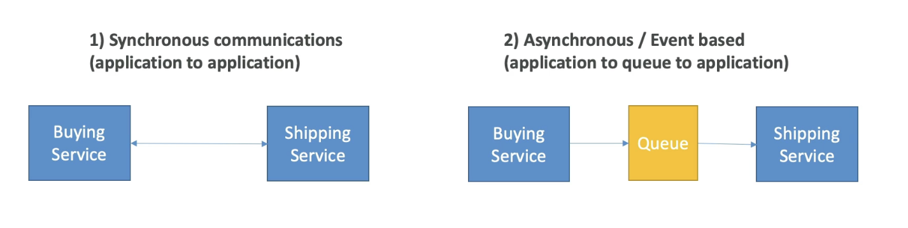

# Cloud Integration

- Application communication
- Two types...
  - Synchronous
  - Asynchronous

## Synchronous Communication

- This can be problematic if there are sudden spikes of traffic
- What is you needs to suddenly encode 1000 videas but usually it's 10?
- It is better to decouple your applications in that case...
  - using SQS: queue model
  - using SNS: pub/sub model
  - using Kineses: real-time data streaming model
- Once decoupled they can scale independently 