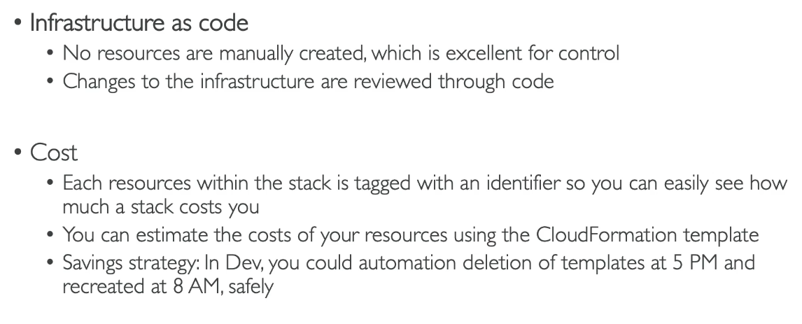
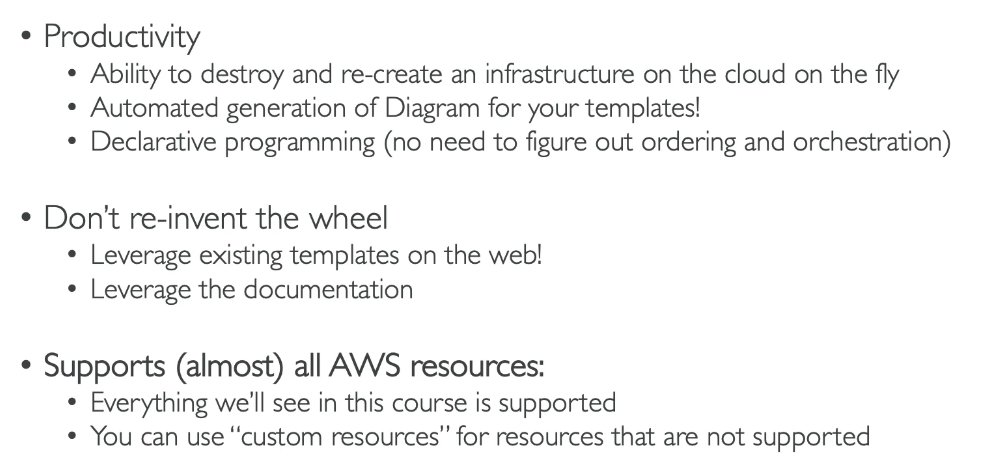

# CloudFormation and CDK

A declarative way of outlining your AWS infrastructure, for any resources (most are supported)

e.g. within a CloudFormation template you say:

- I want a security group
- I want two EC2 instances that use the security group
- i want an S3 bucket
- I want a load balancer in front of these machines

CloudFormation then creates these for you in the right order with the exact configuration that you specify.

## Benefits

- Used when we have infrastructire as code
- When we need to repeat an architecture in different environments, regions and accounts
- Can see a graphical representation of the infrastructure.

## Steps

1. CloudFormation
2. Create Stack
3. us-east-1
4. Template is ready (course has a template)
5. Upload
6. 0-just-ec2.yaml
7. Next
8. name
9. Next
10. Next
11. Create Stack
12. The template will now be used to create the infrastructure e.g. EC2 instance
13. When you delete a stack it deletes all of the elements and resources in the correct order

- You can edit or replace the templates and it will no exactly what to do.

# AWS Cloud Development Kit (CDK)

- A way to define your cloud infrastructure using a familiar programing language e.g. Java, Python
- The code is then compiled bythe CDK into a CloudFormation template (JSON/YAML)
- You can therefore deploy infrastruture and application runtime code together (same language)
  - Great for Lambda functions 
  - Great for Docker containers in ECS/EKS