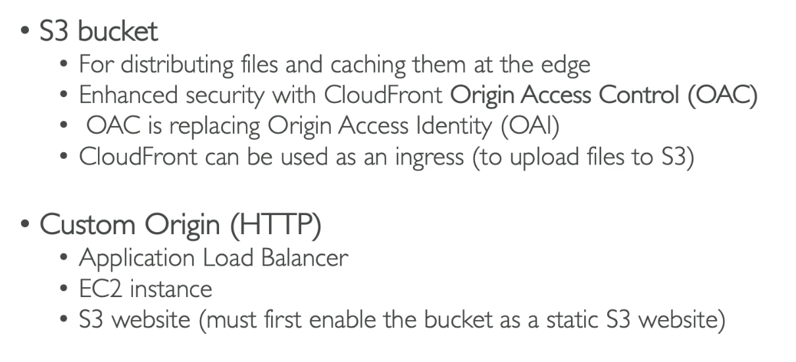
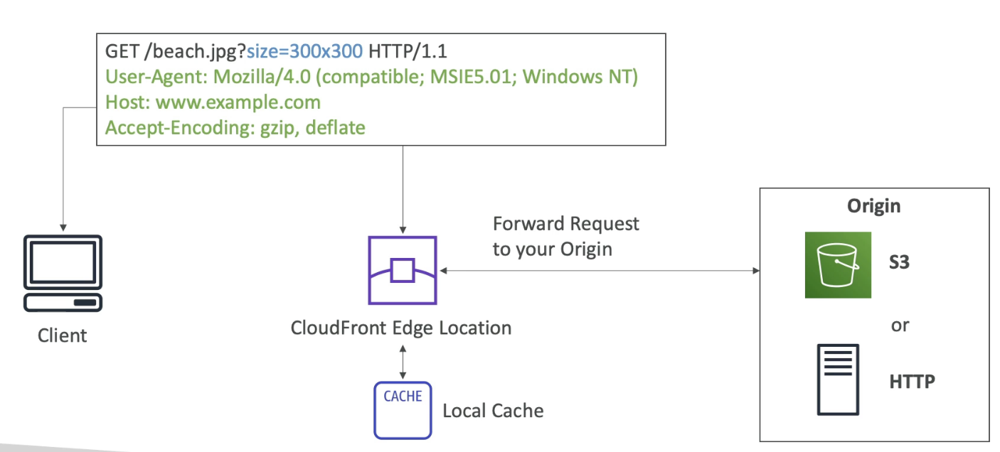
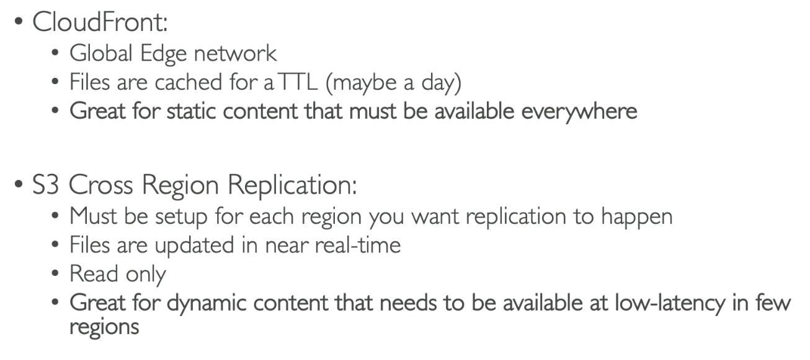

# CloudFront

- A Content Delivery Netword (CDN)
- It improves read performance by caching content at different edge locations all around the world. (improved latency for users)
- 216 Points of Presence (edge locations)
- DDoS protection (because it is worldwide), integration with Shield, AWS Web Application Firewall
- Info is cached for a day. 

# CloudFront - Origins

# How does it Work?

- If the edge location doesn't have the info it will get it from the origin and cache it for the next time it is requested by a client.

# CloudFront Vs. Cross Region Replication

- Caching vs. replicating entire s3 buckets.

# Steps

- Create an S3 bucket (default settings)
- Upload some files into the bucket e.g. .html and images
- CloudFront
- Create
- domain = your bucket
- Origin access control
- Create control setting (default settings)
- Web Application Firewal: Do not enable
- Default root object: index.html
- Create
- Copy bucket Policy (also in bucket origins > edit)
- Go to S3 bucket > permissions
- Edit bucket policy and paste it in.
- Wait for distribution to deploy
- Go to domain.
- If refreshed the loading will be quicker as it is served from the cache.