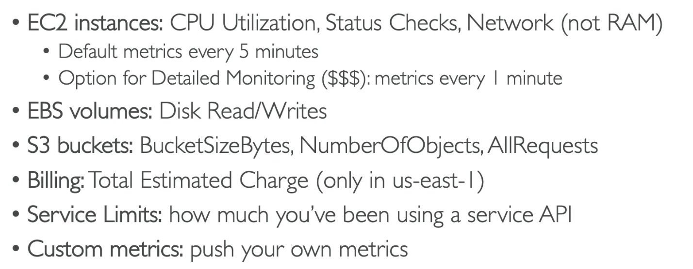
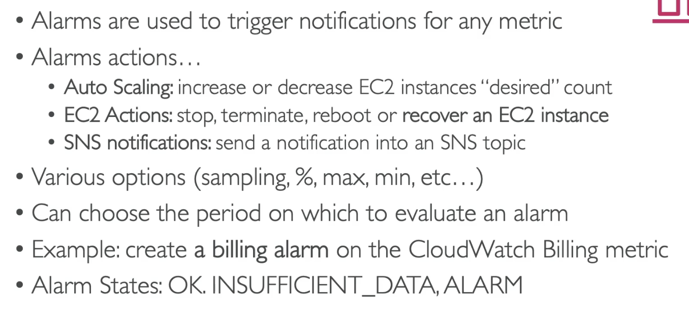
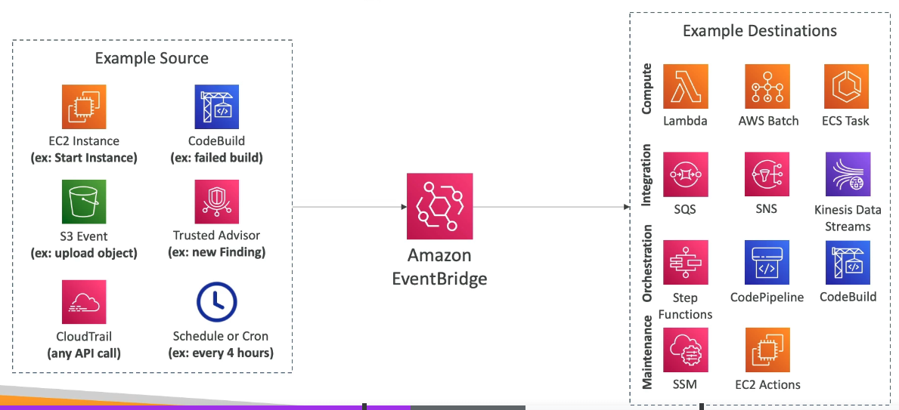
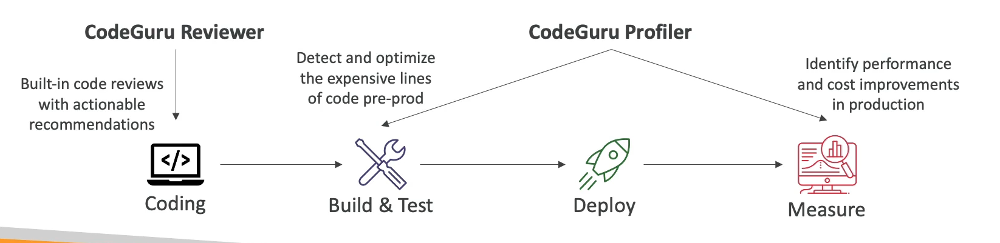

# CloudWatch

# CloudWatch Metrics

- Metric: A variable to monitor e.g. CPUUtilisation
- CloudWatch provides metrics for every AWS service
- Metrics are monitored over time (have timestamps)
- You can create a CloudWatch dashboard of metrics

## Important Metrics

## CloudWatch Alarms

- Alarms are used to trigger notifications for any metric.
- When the metric goes above a threshold the alarm can cause an action.

### Alarm Actions

# CloudWatch Logs

- Highlu scalable service that collects log files and centralises them. 
- Log: file the application has written about how it is doing
- Allows from real time monitoring of the logs.
- Retention of the logs is adjustable (1 week - infinity)

## How it works...

- Need to run a CloudWatch agent on EC2 to push the log files you want onto the service (IAM permissions)
- CloudWatch agent can also be set up on On Premise Servers

# EventBridge/CloudWatch Events

- You can react to things happening in your AWS accounts
- e.g.Scheduling Cron Jobs (scheduled scripts) every hour
- You can archive events and replay them
- You can model event schema using Schema Registry

- Default Event Bus (triggered from within AWS):
- Partner Event Bus (triggered by events within Partners of AWS) 
- Custom Event Bus (triggered by events within your Custom apps)

# CloudTrail

- Provides governance, compliance and audit for your AWS account.
- Enabled by default.
- Trail: History of events/API calls within your AWS Account. e.g. a resource being deleted
- Trail can be sent to S3 or CloudWatch Logs for longer retention.
- A trail can be applied to all regions(default) or a single region.

# X-Ray

- Helps you debug in production, especially when the application is distributed services
- Gives you a visual analysis of the services, their requests, their performance, where they are failing etc.
  - Understanding dependencies
  - pinpoint service ussues
  - review request behaviour
  - find errors and exceptions
  - where is it throttled
  - identify users that are impacted

# CodeGuru

- A machine learning service
  1. CodeGuru Reviewer: Automated code reviews (during development/ on static code in a repo) e.g. critical issues, hard to find bugs
  2. CodeGuru Profiler: Application performance recommendations (pre-prod and production) e.g. code inefficiencies, improve app performance (CPU utilisation)

# AWS Health Dashboard

## Service History

- Shows the health of all regions and services for each day

## Your Account

- Provides alerts and remediation guidance when AWS is experiencing events that may impact you, and past events.
- Personalised view of the performance and availability of teh services underlying your resources.
- Can aggregate data from an entire AWS Organisation.