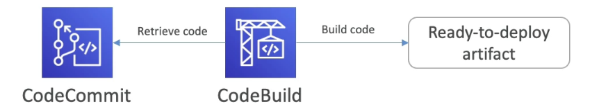
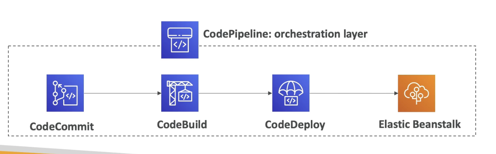
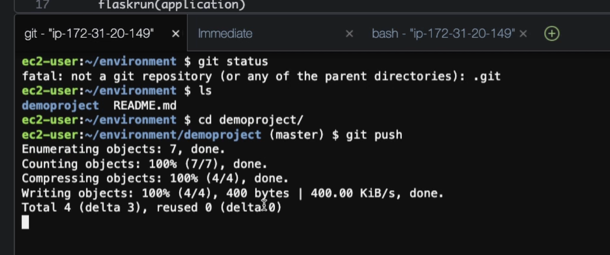

# Code Services

# CodeDeploy

- A way to deploy our application automatically.
- Completely independent to CF and Beanstalk
- Works with EC2 instances and On-Premises Servers (hybrid service)
- Servers/Instances must be provisioned and configured ahead of time and they must have installed the CodeDeploy Agent.

# CodeCommit

- AWS's version of a version control repository to store your code before pushing to servers (e.g. similar to GitHub)
- Fully managed
- Scalable and highly available
- Within AWS account, so private, secured and integrated with AWS services.

# CodeBuild

- Code building service in the cloud.
- Compiles, runs tests, produces packages that are ready to deploy

- Fully managed and serverless
- Scalable and highly available
- secure
- Pay-as-you-go - only pay for build time

# CodePipeline

- Orchestrates the steps to have the code automatically pushed to production.
- Builds a CICD pipeline using other services.
- e.g. Code > Build > Test > Provision > Deploy

- Fully managed
- Compatible with many AWS services and 3rd party services (GitHub).
- Fast delivery and rapid updates

# CodeArtifact

- A artifact management system, as well as a place to store code dependendies.
- (usually you would need to set up your own artifact management system.)
- Artifact management: Storing and retrieving code dependenciies.
- Code dependencies: Need them for the software to be built

# CodeStar (will be replaced with CodeCatalyst)

- A unified UI to easily manage software devlopment activities in one place.
- Quick way to get started to correctly set-up CodeCommit, CodePipeline, CodeBuild etc.
- Can edit the code "in-the-cloud" using AWS Cloud9

# Cloud9

- A cloud IDE (Integrated Development Environment)
- For Writing, running and debugging code in the cloud. 
- A code editor on the web i.e. like intellij but on the cloud
- Multiple people can edit the code at the same time

# Steps: Create and deploy a Beanstalk application using CodeStar and Cloud9

1. CodeStar
2. Create project
3. Create a service role
4. Python (Flask)
5. Next
6. name
7. CodeCommit repo
8. EC2 = t2.micro
9. Create a key pair in EC2 if needed
10. Create project

## Editing using Cloud9

1. IDE
2. Cloud9
3. t2.micro
4. environment name
5. 30 mins
6. Wait for it to be created
7. Open IDE
8. Can edit your code within the code editor online
9. Save
10. Git icon on the left
11. commit by clicking the plus buttom beside the changes
12. add a message
13. control enter to commit
14. Git push in the command line

15. The commit will strigger the pipeline.
16. Wait
17. Changes will be applied to the application.