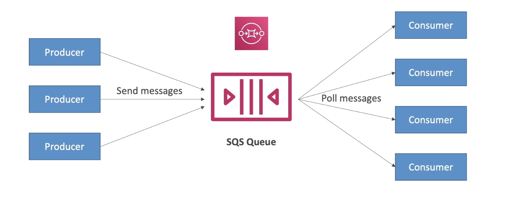
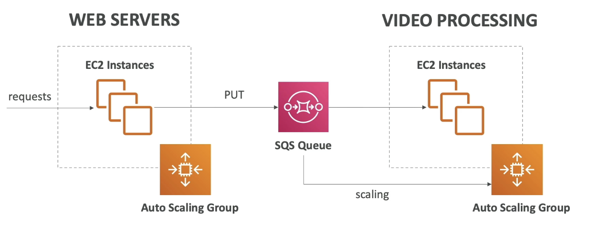
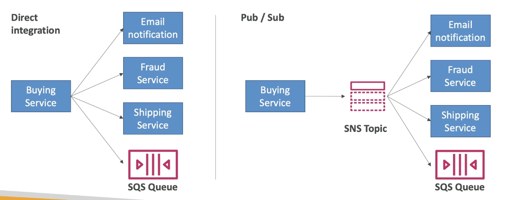

# Communication Models

- Services that allow us to decouple our applications

# Amazon SQS: Simple Queue Service

- Producers send messages to a queue
- Consumers pull messages from the queue and process them, and then delete the message.

- Fully managed and therefore serverless
- Used to decouple applications
- No limit to messages in the queue
- Max of 14 day retention of messages
- Low latency
- Consumers scale horizontally and independently based on number of messages

## FIFI Queue

- First in First out 
- Processed in order

# Steps

1. Aamazon SQL
2. Create queue
3. standard
4. name 
5. Leve everythng as default
6. Create
7. Send and recieve messages
8. Add text to message body and send

# Amazon Kinesis

- Real-time big data streaming
- Managed service to collect, process and analyse real-time streaming.
- Has sub-services

# Amazon SNS

- Allows you to send one message to many recievers
- Don't need to create many protocols
- Each subscriber will get ALL the messages
- Subscribers can be many services/emails/Mobile Notifications/HTTP endpoints
- No message retention

# Steps

1. Simple Notification Service
2. Create topic
3. Default settings
4. Create
5. Create subscriptions e.g. email
6. Publish message

# Amazon MQ

- A managed message broker service for RabbitMQ and ActiveMQ
  - Those technologies are on-prem services that provide access to open protocals e.g. SQS, SNS that can then be brought up to the cloud.
- Amazon doesn't scale as much as SQS/SNS
- Runs on servers so can have server issues (so multi-AZ setup with failover)
- Has queue feature (SQS) and topic features (SNS)
- Only used if company is migrating to the cloud and needs to used on of these open protocols

