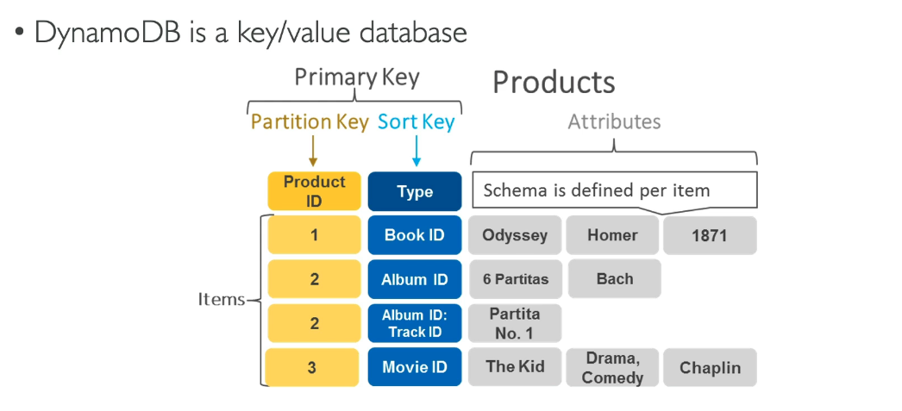
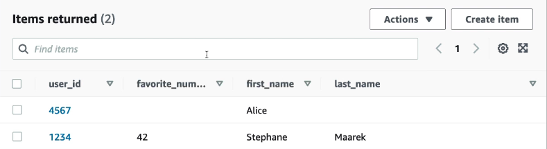
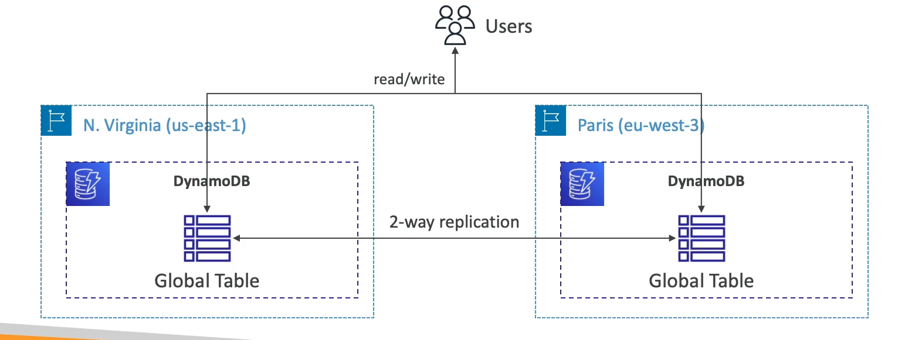

# Database: DynamoDB

- A fully managed highly available dtatabase with replication across 3 AZ's.
- All the data is in one table, compared to RDS which is a relational DB with linked tables
- NoSQL (not a relational database)
- Distributes "serverless" database
- Scales to massive workloads
- Millions of requests per second, trillions of row, 100s of TB of storage
- Fast and consistent in performance
- Single-digit millisecond latency - low latency retrieval
- Integrated with IAM for security, authorization and administration
- Low cost and auto scaling capabilities
- Standard and Infrquent Access (IA) Table Class

## Type of data

## DynamoDB Accelerator - DAX

- Fully managed in-memory cache specifically for DynamoDB (only used for DynamoDB)
- Caches most frquently read objects.
- 10x performance improvement when accessing tables
- Secure, highly scalable and highly available

# Steps

1. DynamoDB
2. Create table
3. name
4. patition key
5. default settings
6. create table

1. Click on table
2. View items
3. Create item (Insert some data)
   - name, value and type

## DynamoDB - Global Tables

- A way to make a DynamoDB table accesswible with low latency in multiple-regions
- Replication of global tables in different regions, with two way replication.
- Read/write to any region, therefore active-active replication.

