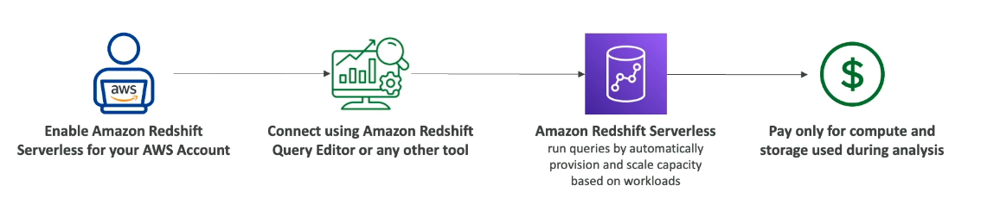
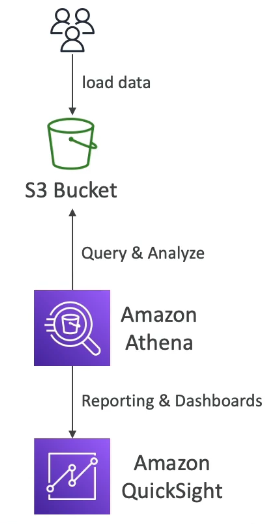
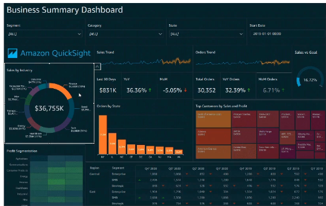
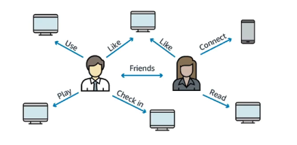
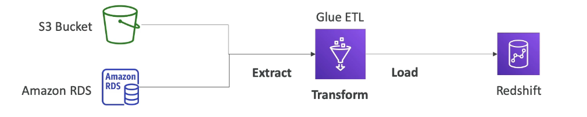

# DB Overviews

# Redshift

- A database based on PostgreSQL, but is not used for OLTP (online transaction processing), which RDS was good for.
- Instead it is OLAP - online analytical processing (analytics and data warehousing).
- Don't load data continously (once an hour not every second)
- Really good at analysig data and computation so has 10x better performance than other data warehouses
- Columnar storage of data (instead of row based)
- Massively Parallel Query Execution (MPP) to do teh computation quickly
- Pay as you go based on the instances provisioned
- Has a SQL interface for performing quick queries
- BI tools like AWS Quicksight or Tableau can be integrated to create dashboards on top of your data

## Redshift Serverless

- Allows you to run redshift without worring about scaling the data warehouse or provisioning it. (done automatically)
- Runs analytics workloads without managing data warehouse infrastructure.
- Pay only for what you use (save costs)
- Use Cases: reporting, dashboarding applications, real-time analytics...

# EMR

- EMR = "Elastic MapReduce"
- Not really a database
- It helps create Hadoop clusters(Big Data) to analyse and process vast amounts of data. 
- Hadoop = open source technology, allows a cluster of servers to analyse data together
- In EMR the clusters can be made of hundreds of EC2 instances.
- EMR takes care of provisioning and configuration of the instances.
- Has auto-scaling and integrated spot instances
- Use Cases: data processing, machine learning, web indexing, big data

# Amazon Athena

- A serverless query service to perform analytics against S3 objects.
- Uses SQL language to query the files (supports many types e.g. CSV, JSON, ORC, Avro and  Parquet)
- Ifyou want you can have reporting on top of athena by using Amazon QuickSight.
- $5.00 per TB of data scanned
- Use compressed or columnar data for cost-savings (less scan)
- Use Cases: Business intelligence/ analytics/ reporting, analyse and query VPC Flow Logs, ELB Logs, CloudTrail trails, etc.

# QuickSight

- Serverless machine learning-powered business intelligence service to create interactive and visual dashboards.
- Fast, automatically scalable, embeddable
- per-session pricing
- Use Cases: Business analytics, Building visualisations
- Ad-hoc analysis
- Can be integrated with RDS, Athena, Aurora, Redshift, S3 etc.

# Document DB

- Like Aurora but for MongoDB (NoSQL database), rather than SQL.
- MongoDB is used to store, query and ondex JSON data.
- Similar deployment concepts as Aurora
- Fully managed, highly available with replication across 3 AZ
- DocumentDB storage automaically grows in increment of 10GB
- Automatically scales to workloads with millions of requests per second.

# Amazon Neptune

- Fully manages graph database for a graph dataset e.g. a social network.
  - Users have friends
  - Posts have comments
  - Comments have likes from users...
- Highly available across 3 AZ, with up to 15 read replicas.
- Build and run applications working with highly connected datasets - optimised for these complex and hard queries
- Can store billions of relations and query the graph with miliseconds latency
- Highly available with replications across multiple AZs
- Use Cases: Great for knowledge graphs (wikipedia), fraud detection, recommendation engines, social networking.

# Timestream

- Used for time series data (data that evolves over time)
- Fully managed, fast, scalable, serverless
- Automatically scales up/down to adjust capacity
- Store and analyse trillions of events per day
- 1000s times faster and 1/10th of the cost of relational databases
- Built-in time series analytics functions (helps you identify patterns in your data in near real-time)

# Amazon QLDB

- Quantum Ledger database
- Recording financial transactions
- Fully managed, serverless, high availibility, replication across 3 AZ
- Used to review history of all the changes made to your application data over time
- Immutable system: no entry can be removed or modified, cryptographically verifiable
  - QLDB Journal with a sequence of modifications that verifies this
- 2-3x better performance that common ledger blockchain frameworks, manipulate data using SQL
- No decentralisation component (in line with financial regulation rules) - this is different to Managed Blockchain.

# Managed Blockchain

- Blockchain makes it possible to build applocations where multiple parties can execute transactions without needing a trusted, central authority.
- Decentralisation
- Amazon Managed Blockchain is a managed service to...
  - Join public blockchain networks
  - Create your own scalable private network
- Compatible with the blockchain frameworks "Hyperledger Fabric" and "Ethereum".

# AWS Glue

- A managed extract, transform, and load (ETL) service
- Useful to prepare and transform data for analytics
- Serverless

## Glue Data Catalog

- A catalog of datasets
- Can be used by Athena, Redshift, EMR 

# DMS - Database Migration Service

- Used to quickly and securely migrate databases to AWS
- Resiliant and self-healing
- The source database remains available during migration

Supports:
- Homogenous migrations: same database technology for the databases
- Heterogenous migrations: different database technology for each database (can convert the data)
  - e.g. ex Microsoft SQL Server to Aurora

