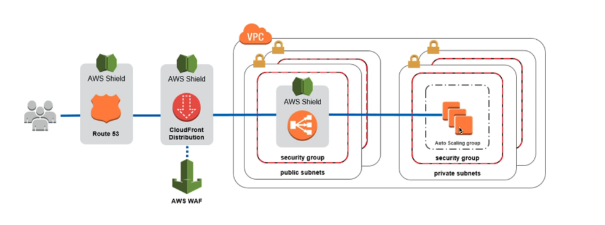
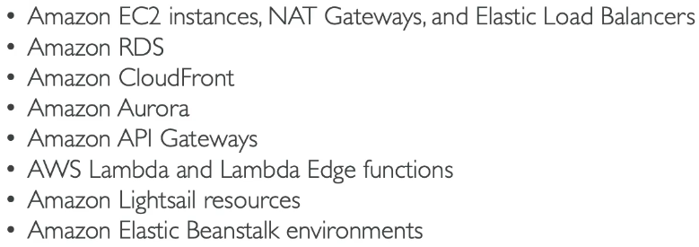
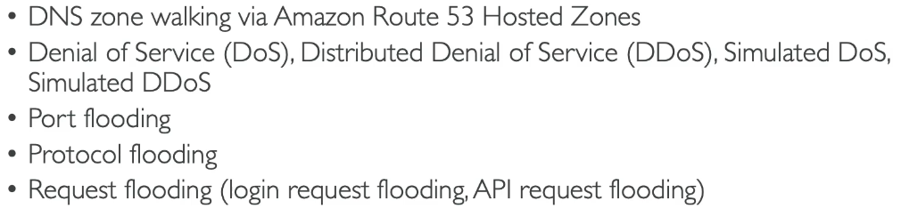

# DDOS

- A DDOS (Distributed Denial-of-Service) attack.

e.g. A hacker wants to attack our application server

1. The hacker will launch multiple master servers.
2. The master servers will launch multiple bots
3. The bots will send requests to the application server.

- The server can't handle this many requests and so it will become overwhelmed and not work anymore for normal users.

# Protection against DDOS Attacks

- AWS Shield Standard: Protects your website and applications against common attacks for all customers by default at no additional cost.
- AWS Shield Advanced: 24/7 premium protection against sophistocated attacks, a response team and protection against fee spikes during an attack ($3,000/month)
- AWS WAF: A firewall that filters specific requests based on rules, protects against common web exploits (level 7: HTTP) and common attacks e.g. SQL injection
  - Deploy on Application load balancer, API Gateway, Coudfront
  - Define Web Access Control List e.g. IP addresses, HTTP headers, HTTP body or URI strings
  - Block countrues with geo-match
  - Rate-based rules (users can't send more than 5 requests/second)
- CloudFront and Route 53: Availibility protection using global edge network. Combined with AWS Shield it can provide attack mitigation at the edge.

- AWS Auto Scaling: Useful when being attacked

# AWS Network Firewal

- Protects your entire Amazon VPC.
- Protects from Layer 3 to Layer 7 
- Inspects from any direction
  - VPC to VPC traffic
  - Outbound to internet
  - Inbound from internet
  - Site-to-Site VPN/ Direct Connecion.

## Firewall Manager

- A service that allows you to manage the securtity rules in all accounts of an AWS organisation in one place.
- e.g. Managing VPC security Groups (for EC2, load balancer etc.) across multiple accounts of an organisation
- Rules are applied to new resouces as they are created across all and future accounts in your organisation. (Good for compliance)

# Penetration Testing on AWS Cloud

- When you attack your own infrastructire to test your security.
- AWS customers can do this without prior approval for 8 services...

- BUT some types of testing are prohibited as they look too much like a real attack...
  

