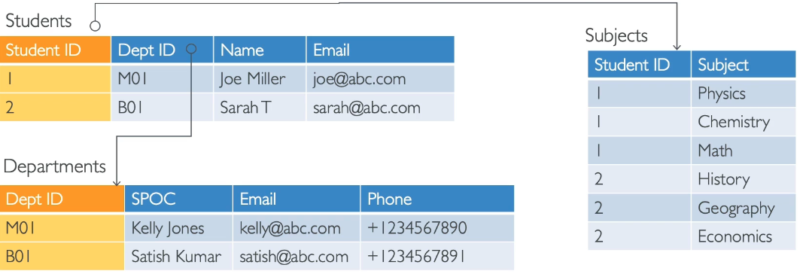
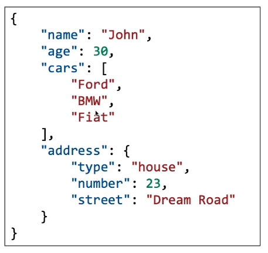

# Databases

- A structured way to store data.
- We build indexes to eficiently query/search through data.
- We define relationships between your datasets.
- Different types of database suit different use cases.
  - They are optimised for purpose and come with different shapes, features and constraints.

## Relational Databases

- Tables with links between them.
- Use SQL language to perform queries/lookups.

## NoSQL Databases

- NoSQL = non-DQL = non relational databases.
- Purpose built for specific data models and have flexible schemas(shape of data) for building modern applications.
- Benefits:
  - Flexibility: easy to evolve data
  - Scalibility: designed to scale-out by using distributed clustres
  - High-performance: optimised for specific data model
  - Highly functional: typpes optimised for the data model
- e.g. key-value, document, graoh, in-memory, search databases

### e.g. JSON format

- Data can be nested (address includes type, number, street)
- Fields can change over time (we can add new fields)
- Support for arrays (three cars within cars)
