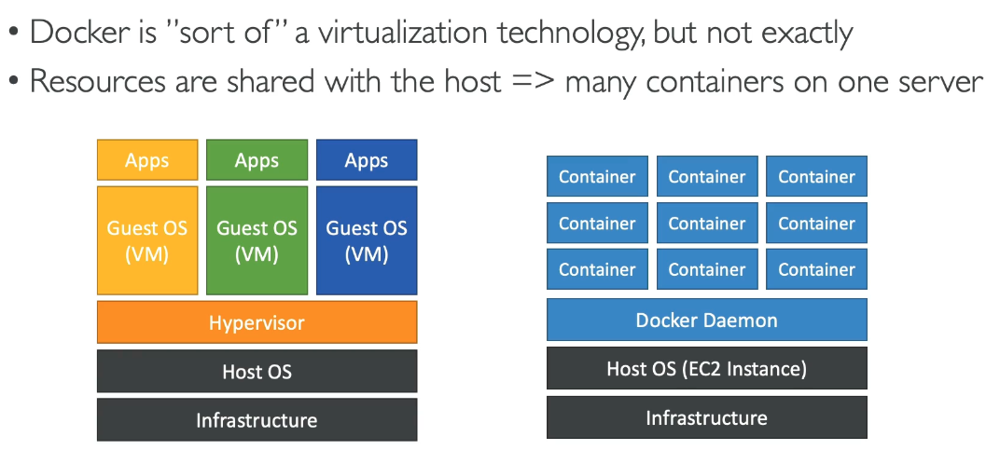
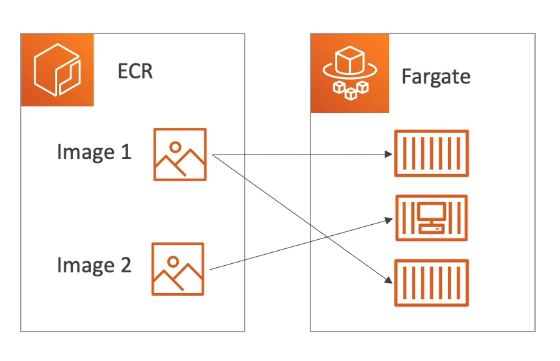

# Docker, ECS, Fargate, ECR

A software development platform for deploying apps.

- The apps are packaged in containers that can be run on any operating system.
- Therefore the apps run the same, regardless of where they're run
  - any machine
  - no compatibility issues
  - predictable behaviour
  - less work
  - easier to maintain and deploy
  - works with any language, any os, and technology
- The containers can be scaled up and down very quickly.

Docker makes it easier for programms to be run on an EC2 instance...

- Multiple docker containers can run on one EC2 instance e.g. one running MySQL and one running java code etc.

- Docker images are stored in Docker Repositories 
- e.g. Amazon ECR (Elastic Container Registry) - private
- Docker Hub - public

### Docker vs. VM

- Docker is more scalable, more lightweight, very versatile and easy to run.

# ECS

- Elastic Container Service.
- Used to launch docker containers on AWS.
- Need to create the EC2 instances in advance.

# Fargate

- Also used to launch docker containers on AWS.
- BUT we do not need to provision the infrastructure (no EC2 instances to manage). - Simpler!
- Serverless offering as we do not have to manage any servers.
- AWS runs containers for you based on the CPU/RAM you need.

# ECR

- Elastic Container Registry
- Private Docker Registry on AWS
- This is where you stpre the docker images so they can be run by ECS or Fargate

- Image stored on ECR and then Fargate creates a container from them and runs it on the fargate service.

