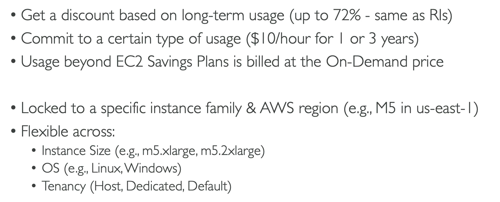
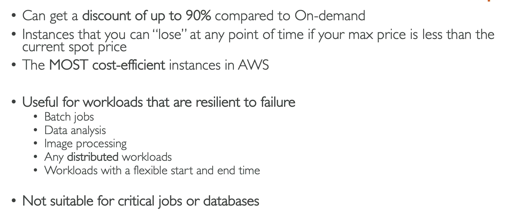
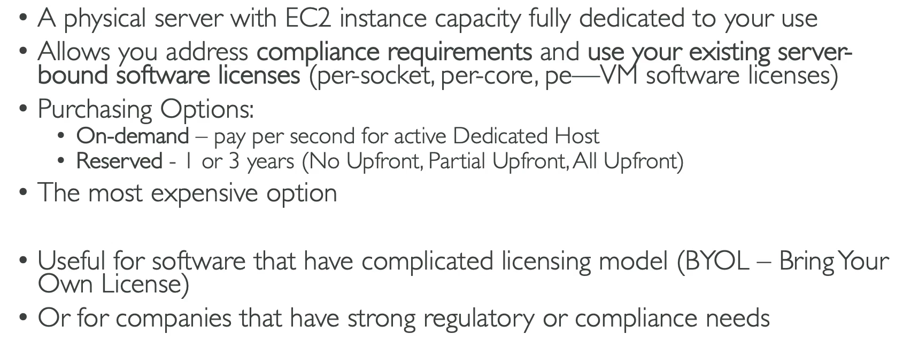
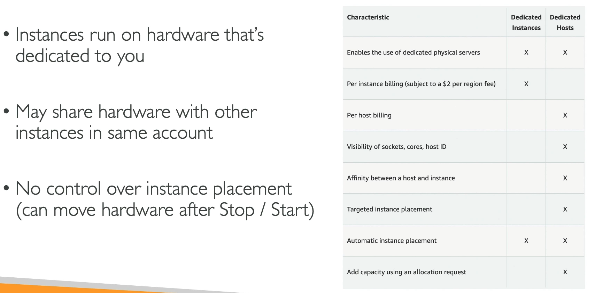
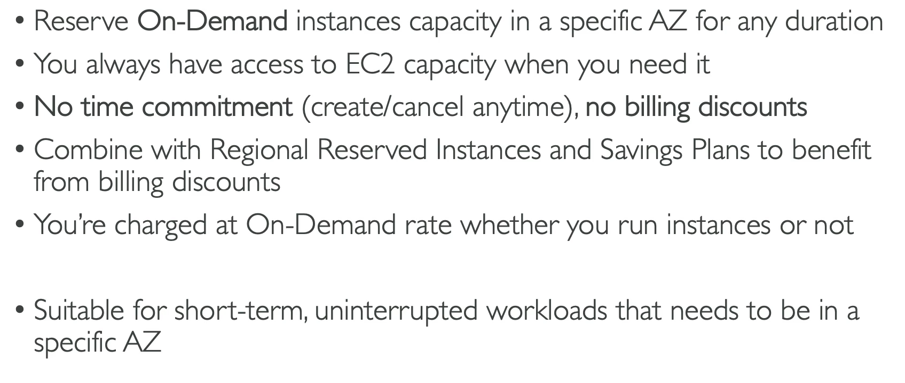

# EC2 Instance Purchasing Options

## On-Demand Instances

- Short workload
- Predictable pricing
- Pay by second

- Highest cost but no upfront payment and no long-term commitment
- Good for short-term and un-interupted workloads, where you can't predict how the application will behave.

## Reserved (1 or  3 years)

- Reserved Instanced: long workloads
- Convertible reserved instances: long workloads with flexible instances

- discount compared to on-demand
- you can buy and sell in the reserved instance marketplace

## savings Plan (1&3 years)

- Commitment to an amount of usage in dollars
- long workload

## Spot Instances

- Short workload
- cheap
- Can lose instances at any time (less reliable)

## Dedicated Hosts

- Book an entire physical server, control instance placement

## Dedicated instances 

- no other customers will share your hardware

## Capacity Reservations

- Reserve capacity in a specific AZ for any duration

