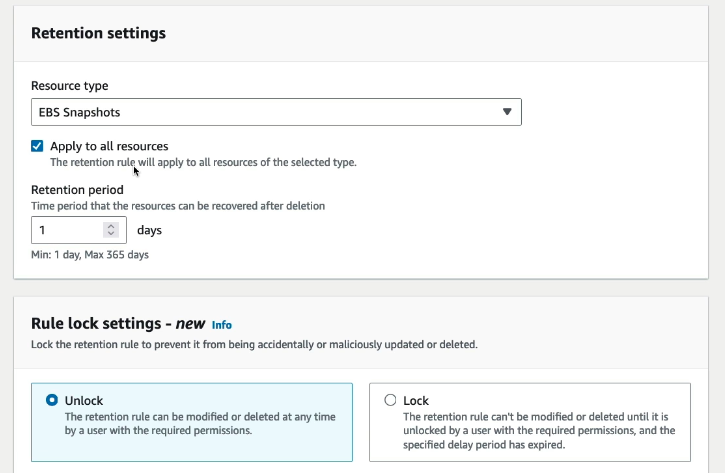
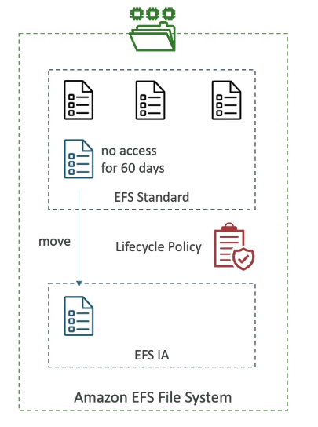
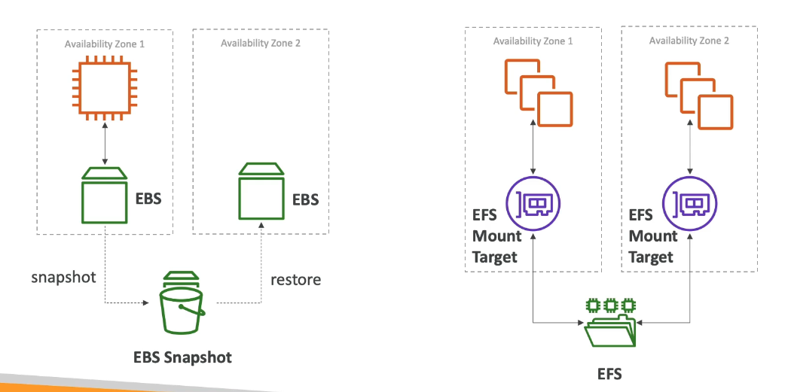

# EC2 Storage Options: EBS, Instance Store and EFS

# EBS Volume

Data storage for EC2 instances.

- Can only be attched to one instance
- Tied to one AZ
- But one instance can have many EBS volumes
- Data persists even after instance termination

- Instances have a root EBS volume by default

- You can select to delete EBS volumes on EC2 instance termination 

### Can also select to not delete root on termination i.e. to save some data

1. Instance
2. storage
3. block devices
4. delete on termination options

## View EBS on instance

1. Instance
2. Storage
3. Root device and block device
4. click on block device to see details

OR

1. Elastic Block Store > Volumes

### Can now also create a volume...

2. Volume Type e.g. gp2
3. Size e.g. 2
4. Availibility zone: same one as instance
5. Create
6. Elastic Block Store>Volumes
7. Select volume
8. Actions>Attach volume
9. specify instance ID

## EBS Snapshots

A backup (snapshot) of your EBS volume at a point in time.

- Recommended to detch the volume from the instance to dothe snapshot.
- Can copy the snapshot between AZ's and Regions.
  - Good for disaster recovery if your data is held in different regions/AZ's

### EBS Snapshot Archive

- You can move your snapshots to an archive tier that is cheaper to store them on.
- But it takes 24 to 72 hours to restore them from the archive

### Recycle Bin

- You can setup rules to retain snapshots in a recycle bin after you delete them incase you need to recover accidental deletions.
- The retention can be from 1 day to 1 year.

# Snapshot Steps

1. Ec2>Volumes
2. Select volume
3. Actions>Create snapshot
4. View in 'Snapshots'

## Copying to different region

1. Select shanpshot
2. right click>copy snapshot
3. Choose the region you want to copy it into

## Create Volume from snapshot

1. Select volume
2. Actions>create volume from snapshot
3. View in 'Volumes'

## Archive the Snapshot

1. Snapshots
2. Select snapshot
3. Actions>Archive snapshot

## Create a retention rule

1. Snapshots
2. Recycle Bin
3. Create retention rule

4. When you delete a snapshot it will be in Recycle bin>resources and you have an option to recover them

# EC2 Instance Store

EC2 Instance store is a high-performace hardware disk that can attach to your instance. (Higher performance than EBS)

- BUT they lose their storage if the instance is stopped, so not good for long term storage.
- Risk of data loss if hardware fails... backups and replication are our responsibility.

# Elastic File System (EFS)

A network file system(NFS) that can be mounted (attached) to 100's of EC2 instances

- Only works with Linux EC2
- Can be mounted across multiple AZ's.
- Data shared by everything mounted to it. (Shared File System)
- Highly availible, scalable, expensive, pay per use, no capacity planning

 

### EFS Infrequent Access (EFS-IA)

A storage class that is cost-optimised for files not accessed every day. (cost-optimisation with no draw backs)

- Much cheaper than EFS standard
- EFS will automatically move your files to EFS-IA based on the last time they were accessed.
- It is transparent to the applications accessing EFS.
- Lifecycle Policy e.g. move files that are not accessed for 60 days to EFS-IA

### EBS vs EFS

Shared vs copies

