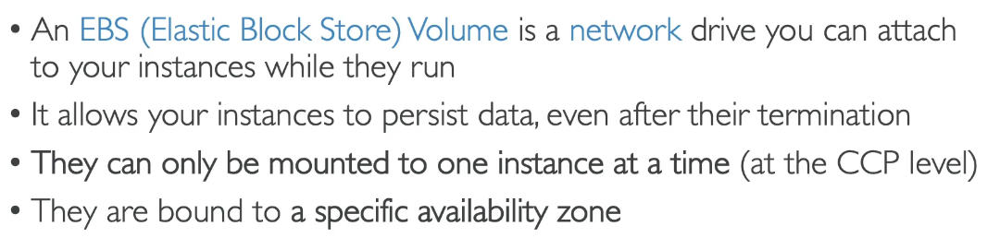
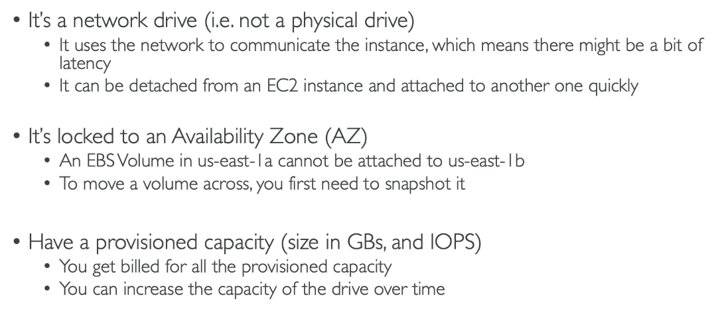

# EC2 Storage Options

## EBS Volume

- Can only be attched to one instance
- But one instance can have many ebs volumes

- Instances have a root ebs volume by default

- You can select to delete ebs volumes on EC2 instance termination 

### Can also select to not delete root on termination i.e. to save some data

1. Instance
2. storage
3. block devices
4. delete on termination options

## View EBS on instance

1. Instance
2. Storage
3. Root device and block device
4. click on block device to see details

OR

1. Elastic Block Store>Volumes

### Can now also create a volume...

2. Volume Type e.g. gp2
3. Size e.g. 2
4. Availibility zone: same one as instance
5. Create
6. Elastic Block Store>Volumes
7. Select volume
8. Actions>Attach volume
9. specify instance ID