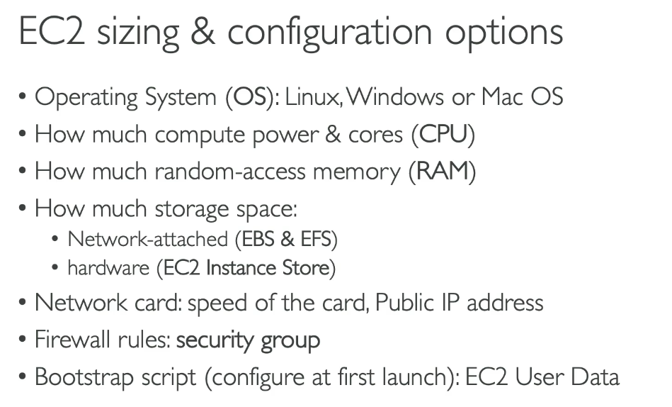
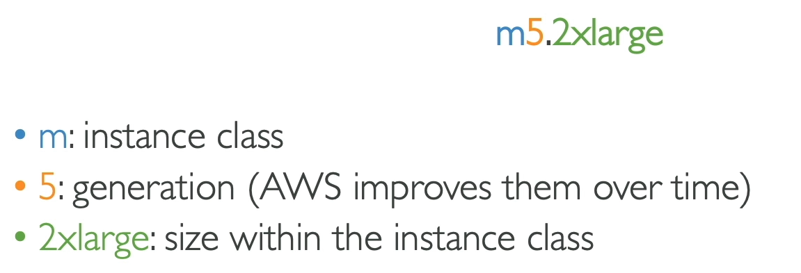
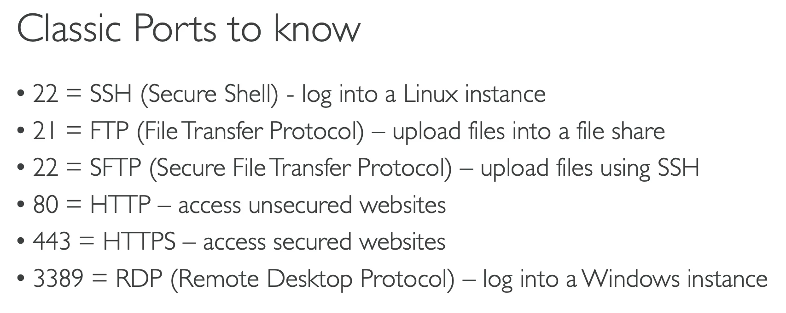

# EC2

- EC2 = Elastic Compute Cloud
- The way to do Infrastructure as a service.

### Consists of...

- Renting EC2 virtual machines
- Storing data on virtual drives (EBS)
- Distruibuting load across machines (ELB - elastic load balancer)
- Scaling the services using auto-scaling group (ASG)

## EC2 Virtual machines

Bootstrapping: launching commands when a machine starts.
- We do this using a user data script.
- Run once when it starts up and never again.
- Used to automate boot tasks e.g. installing updates and software
- runs with root user

## Set Up Notes

Image = the operating system of the instance.

Create a Key Pair:

1. When creating an EC2 instance.
2. Name
3. Key pair type: RSA
4. Private key file format: .pem
5. Create key pair

Instance public IP may change when you stop and restart an instance.

## EC2 Instance Types

Different types are optimised for different use cases.

### Naming convention:

## M = general purpose
 
 - Good for diversity of workloads such as web servers or code repositories.
 - Good balance between compute, memory and networking.

## C = Compute Optimized

- Good for compute-instensive (good CPU) tasks that require high performance processors.
  - e.g. batch processing workloads
  - Media transcoding
  - high performance web servers
  - high performance computing (HPC)
  - Scientific modeling and Machine learning
  - Dedicated gaming servers.

## R = Memory Optimised

- Large RAM for workloads that process large data sets in memory. (higher Mem(GiB))
  - High performance, relational/non- relational databases
  - Distributed web scale cache stores.
  - In-memory databases optimized for BI (business intelligence)
  - Applications performing real-time processing of big unstructured data

## I,D,H = Storage Optimized 

- Good for storage-intensive tasks thta require high sequential read and write access to large data sets on local storage.
  - High frequency online transaction processing (OLTP) systems
  - Relational and NoSQL databases
  - Data warehousing applications
  - Distributed file systems

## Security Groups

- Security groups can allow other security groups access e.g. allows an EC2 instance with an allowed security group attatched
- Inbound and outbound rules
- They can be attached to as many EC2 instances as you like, and EC2 istances can have as many security groups as you'd like.

## EC2 Instance Connect

- Alternative to SSH on the browser.

1. Go to instance
2. Connect
3. EC2 Instance connect

## EC2 Instance Permissions

You can also add credentials and permissions to EC2 instances.

1. Go to your instance
2. Actions>Security>Modify IAM role
3. Select role you want to attach 
