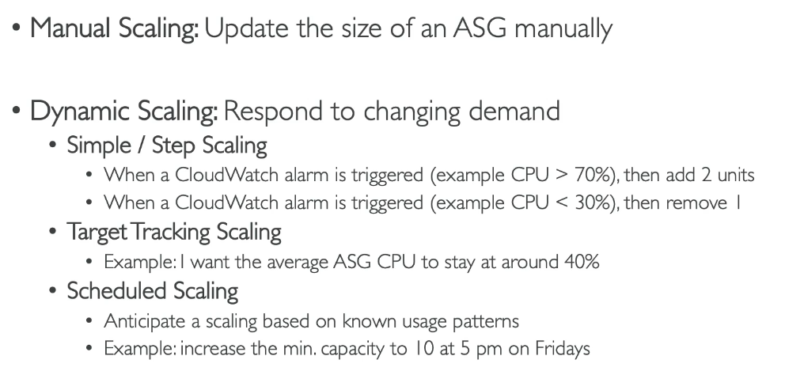

# Elastic Load Balancing and Auto Scaling Groups

## Scalibility

The application can handle greater loads by adapting.

### Vertical: up/down

- increase the size of the instace, 
- common for non distributed systems e.g. database
- usually a limit (hardware limit)

### Horizontal(elasticity): in/out

- increase the number of instances for your application
- Works for distributed system.
- Common for web applications/ modern applications
- Use an auto scaling group and load balancer

## High availibility

- High availibility means running your application in at leat two availibility zones
- therefore hand in hand with horizontal scaling
- The goal is to survive a data center loss e.g. to a power outage
- Use an auto scaling group and load balancer in multi AZ

## Scalibilty vs Elasticity (vs Agility)

# Elastic Load Balancing

## why?

- Spreads the load across multiple instances
- Works across availibility zones: High availibility
- Expose a single point of access (DNS) to your application
- Regular health checks so failures of instnaces can be covered up by not sendingvthem requests
- Orovide SSL termination (HTTPS) for your websites

## Types

1. Application Load Balancer (HTTP/HTTPS traffic only) - Layer 7
2. Network Load Balancer (ultra-high performance, allows for TCP and UDP) - Layer 4
3. Gateway Load Balancer - Layer 3

# Steps: Application Load Balancer

1. Create instances e.g. 2 instances
2. Allow for Http traffic in security group
3. User data for website
4. Load balancers
5. Create load balancer
6. Application Load balancer
   - name
   - internet-facing
   - IPv4
   - deploy in all AZ's
   - Create security group
     - allows HTTP traffic (inbound)
   - Create a target route
     - Instances
     - name 
     - HTTP 80
     - HTTP1
     - HTTP
     - Next
     - Select your instances
     - Create
   - add target group
   - create load balancer
7. Wait until the load balancer is active
8. If you paste the DNS name you can access the site and it redirects requests between both instances.

# Auto Scaling Groups

# Steps: Auto Scaling Group

1. Auto Scaling Groups
2. Create Auto Scaling group
   - name
   -  Create launch template (template for the instances it will create)
      - Remember to add user data
    - Next
    - Select AZ's
    - Next
    - Attach to existing load balancer (one we made before)
    - Next
    - max, min, desired
3. It will automatically create the desired number of instances

# Scaling Stratagies

