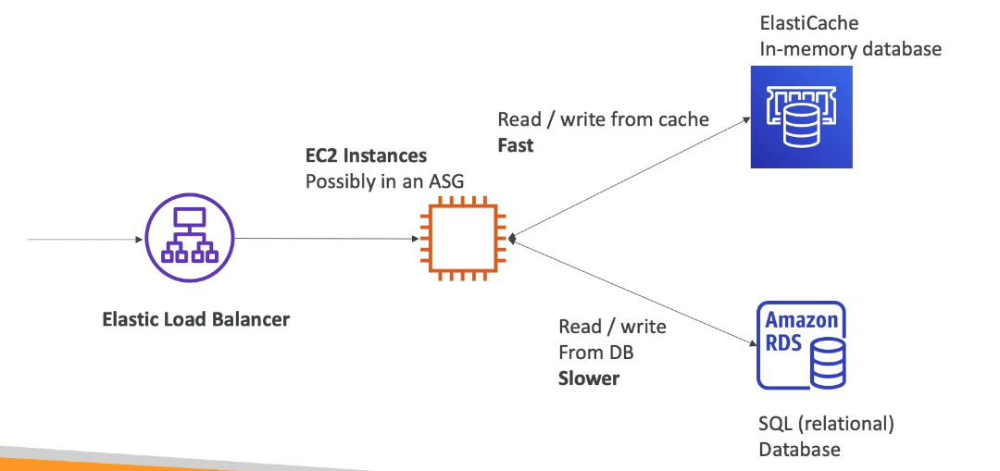

# Amazon ElastiCache

- Like RDS but for managed Redis or Memcached databases.
- You cache some values/queries from the RDS DB in an ElastiCache for fast read/write.
- The caches are in-memory databases and therefore are high performance and low latency
- Helps reduce the pressure off of the RDS database

#### As it is managed...
- AWS takes care of OS maintenance/ patching
- Optmisations
- Setup
- Configuration
- Monitoring
- Failure recovery and Backups

