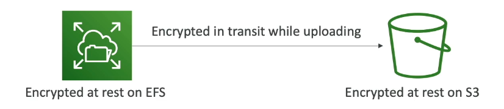
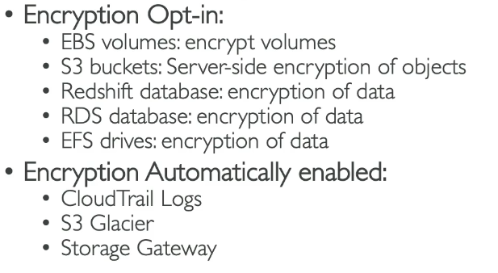
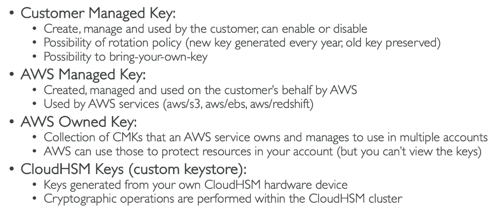

# Encryption

## Encryption at rest

- Data at rest: stored or archived on a device
  - e.g. hard disk, RDS instance, S3 bucket

## Encryption in transit

- Data in transit: The data is being moved from one place to another
  - e.g. on-prem to AWS, EC2 to DynamoDB

- We want to encrypt data in both states to protect it by using encryption keys

# AWS KMS (Key Management Service)

- AWS Manages the encryption keys for us.
- Manges the software for encyption.

# CloudHSM

- AWS provisions the encryption hardware BUT we manage the keys themselves.
- HSM = Hardware Security Module (the physical hardware AWS has in their datacentres)
  - Is tamper resistant and FIPS 140-2 Level 3 compliance

# Types of KMS Keys

# AWS Certificate Manager (ACM)

- Allows you to provision, manage and deploy SSL/TLS Certificates
- Used to provide in-flight encryption for websites by providing an HTTPS endpoint.
- 