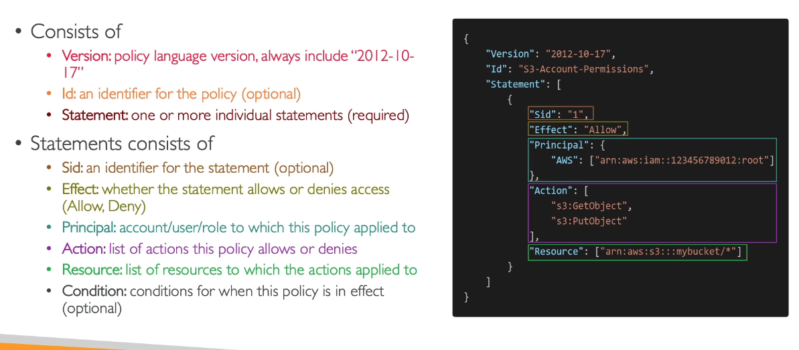

# IAM: Users and Groups

- Identity and Access Management
- A Global service (no region selection required)

## Overview

- Create users and assign them to groups.
- A root user is created by default but should not be used.

## Users

- One user represents one person within your organisation, and can be grouped if it makes sense. e.g. developers group
- Users can belong to multiple groups.
- The users and groups are assigned JSON documents called policies that specify what users have permission to do.
  
- Least Privilege Principle:  don't give more permissions than a user needs.

## IAM Policies

JSON document to define Uses, Groups or Roles' permissions

### e.g.

- AdministratorAccess: Allows access to everything and anything.
- IAMReadOnlyAccess: Read anything on IAM but not edit/create.

## Steps to Create and log-in

1. Go to IAM
2. Users
3. Create user...

4. If you want to create a user for someone else...
   1. Autogenerated password
   2. new password at next sign-in
5. Set permissions...

6. This can be done by creating a group or adding to one as above or attaching policies to the user directly
7. When the groups are created you can choose permissions policies to add.
8. You can now view the detail of the user and group in the 'users' and 'user groups' pages.

### Log in

1. IAM dashboard
2. Copy and use the URL in private browser
3. Enter the specified details to log in

### Creating a Policy

1. IAM
2. Policies
3. Create Policy
   1. Visual or JSON
4. Then create a bespoke policy that you can use on users or groups.