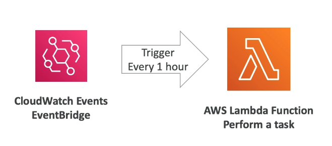

# Lambda

## Benefits of AWS Lambda

- Easy Pricing:
  - Pay per request and compute time
  - Free tier offers a large number of Lambda requests and high GB of compute time
- Integrated with the whole of AWS suite of services.
- Event- Driven: functions get invoked by AWS when needed (reactive service)
- Scales up and down automatocally.
- Integrated with many programming languages
  - e.g. Python, Java, Ruby
- Easy monitoring through AWS CloudWatch
- Easy to get more resources per funcions (up to 10GB of RAM)
- Increasing RAM will also imprive CPU and network
- Lambda Container Image allows you to run Docker containers on top of Lambda
  - Images must implement the Lambda Runtime API so ECS/ Fargate is preffered
- Incovation: Up to 15 minutes

## Use Case: Serverless Thumbnail creation

- Fully event driven and serverless process.

## Use Case: Serverless CRON Job

- CRON allows you to schedule when you run a script e.g. every monday

## Pricing

- Based on Calls and Duration.
- Very cheap.

## Steps

1. Lambda
2. Create a function
3. Blueprint
4. Hello world function, python
5. Name
6. Create a new role with basic Lambda permissions
7. Create function
8. Scroll down>Test
9. Create new test event
10. Name
11. Create
12. Test
13. The code has been uploaded to lambda and then run by lambda

You can also...
- Use Configuration to change memory, timeout and execution role
- Monitor using CloudWatch and CloudWatch logs
- Edit the code you are running

