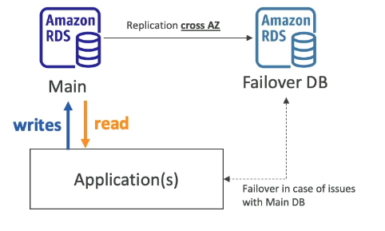

# AWS RDS and Aurora

## RDS

- RDS = Relational Database Service.
- A managed database service.
- Uses the SQL query language
- It allows you to create databases in the cloud that are managed by AWS and can use these engine types...
  - Postgres
  - MySQL
  - MariaDB
  - Oracle
  - Microsoft SQL Server
  - Aurora (AWS Proprietary database)

## RDS vs. Deploying a DB on EC2

### RDS is a managed service so...
- The DB provisioning is automatic and patchin of the OS is done by AWS
- Continuous backups and restore options (Point in Time Restore)
- Monitoring dashboards
- Read replicas for improved read performance
- Multi AZ setup for disaster recovery
- Maintenance windows for upgrades
- Scaling capability (vertical and horizontal)
- Storage backed by EBS

### BUT you can't SSH into your instances

## RDS Solution Architecture

# Steps

1. Amazon RDS
2. Databases
3. Create database
4. Standard create
5. Engine type: MySQL
6. MySQL Community
7. Latest version
8. Free tier template
9. Names and password
10. Burstable, DB instance class: t2.micro
11. Connectivity
12. Public access: yes
13. New security group
14. AZ = no preference
15. Compute Resource = don't connect to an EC2
16. Network Type = IPv4
17. Authentication: password
18. Create
19. On the database page it will show endpoint and port to connect and also monitoring graphs
20. You can also take a snapshot and create another DB from it. (Actions>take snapshot>restore snapshot)
    - to make larger, diff settings, diff region for disaster recovery
21.  Can also share snapshot so other accounts can restore their databse from yours

# RDS Deployment Options

- There are many architectural choices you can make...

## RDS Read Replicas

- Creates copies(read replicas) of your database that can be read from by your application if the workload gets too high.
- You can create up to 15.
- BUT Writing data can only haooen to the main database

## Multi-AZ

- Creates a Failover DB in a different AZ.
- Makes the DB high availibility
- When an availibility zone crashes the Failover DB will be used.
- BUT it is passive, you can still only read and write to the main DB
- You can only have 1 failover.

## Multi-Region

- Read replicas across different regions
- Applications can read from local reda replica
- BUT can only write to the main DB
- Good for regional issues for disaster recovery
- Better local performance for reads
- Replication cost for transfering data across regions

# Amazon Aurora

- A proprietary tcehnology from AWS (not open sourced)
- A fully managed relational database engine that's compatible with MySQL and PostgreSQL.
- It is cloud optimised and clains to deliver five times the throughput of MySQL and up to three times the throughput of PostgreSQL.
- Aurora's storage automatically grows in increments of 10GB
- Costs more than RDS - but is more efficient
- Not in the free tier.

## Amazon Aurora Serverless

- Automates databse instantiation
- Auto-scaling based on actual usage
- PostgreSQL and MySQL are supported
- No capacity planning needed
- No management overhead as you don't manage servers
- Pay per second so can be more cost-effective
- Use Cases: infrequent, intermittent or unpredictable workloads

- Connects to a proxy fleet managed by Aurora.
- Aurora will instantiate database instances when it needs to scale up or down
- All the database instances share the same storage volume.

