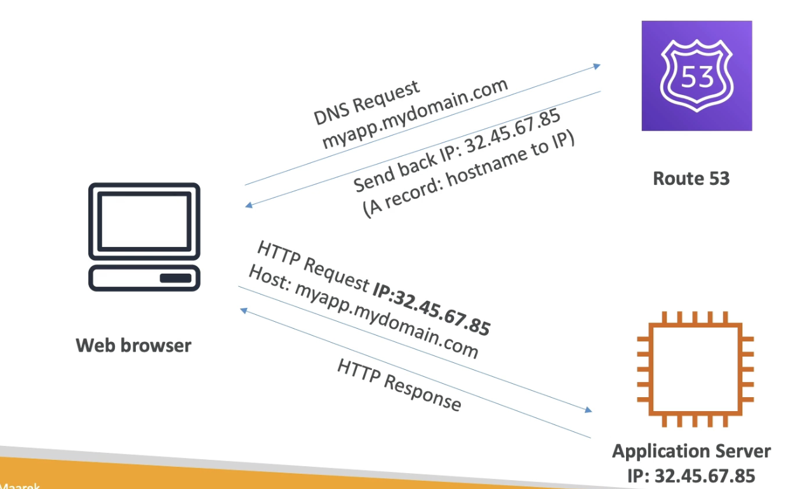
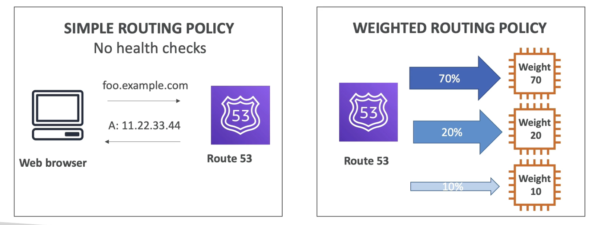
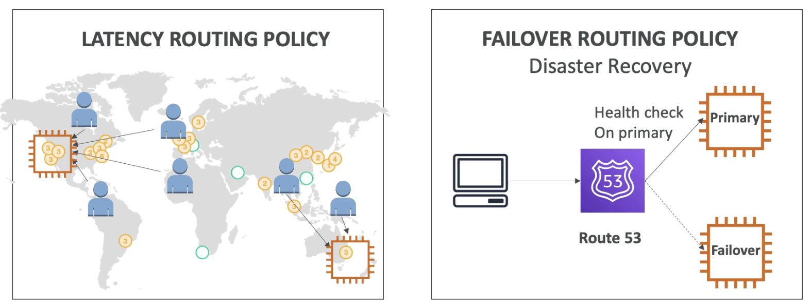

# Route 53

- Route 53 is a managed DNS (Domain Name System)
- A DNS is a collection of rules and records that helps clients understand how to reach a server through URLs.

## Diagram for a Record

- Uses Route 53 to be able to use an URL to get the IP address of the application server

## Routing Policies

- They choose which server based on...
- nothing
- health + load (kind of like a load balancer)
- health + distance
- health

