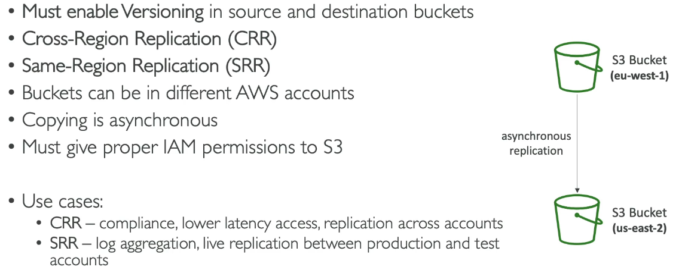

# S3: Encryption

## Server-Side Encryption

- By default on buckets and objects when they are created.
- The server encrypts the file after recieving it.
- Always on by default

## Client-Side Encryption

- The client encrypts the file before uploading it onto S3.
