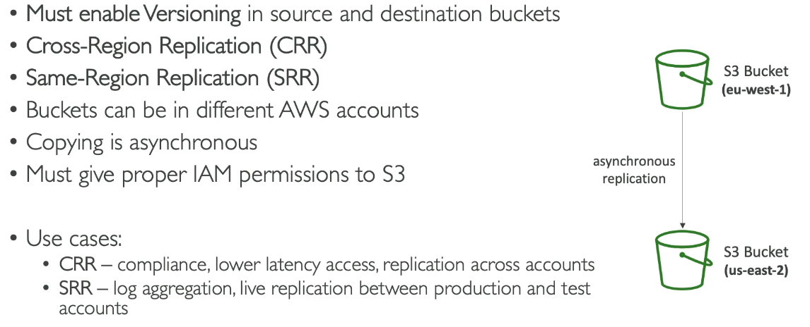

# S3: Replication

To set up asynchronous replication between two buckets.

# Steps

1. Create two buckets
2. They must both enable versioning.
3. Origin bucket>management
4. Replication rules>create replication rule
5. Name
6. Anables
7. Apply to all onjects in bucket
8. Choose a bucket in this account
9.  Select replica bucket
10. Select create a new role, but don't do it yet!
11. Save
12. Don't replicate existing objects.
13. When you upload a new file in the origin bucket it appears in the replica (and the versions will be the same)
