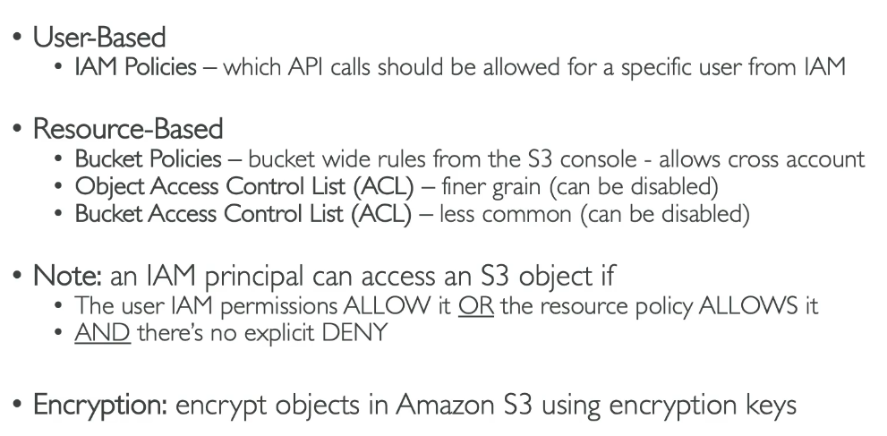
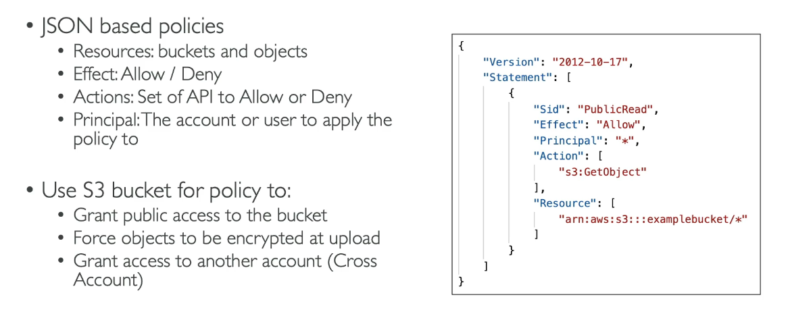
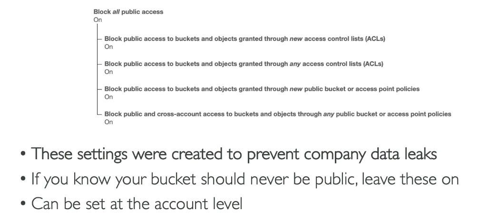

# S3: Security

## Bucket Policies

Therefore thhis example allows anyone to read any object from the 'examplebucket'.

## Giving Permissions...

Public Access: bucket policy that allows public access
User Access: IAM Policy to that user
Cross-Account Access: bucket policy that allows cross-account access for that user from another account
EC2 Instance Access: EC2 instance role that allows access

## BlockPublic access

# Steps: Bucket policy that allows access to object via public URL

1. Enter your bucket
2. Permissions
3. Block public access (bucket settings)>edit
4. Uncheck
5. Bucket policy>edit
6. Policy generator
7. s3 bucket policy
8. Allow
9. *(anyone)
10. Amazon S3
11. GetObject
12. ARN: arn/*
    -  You can find and copy the arn on the edit bucket policy page
13. Add statement
14. Generate Policy
15. Save changes
16. You can now view the object from the public URL