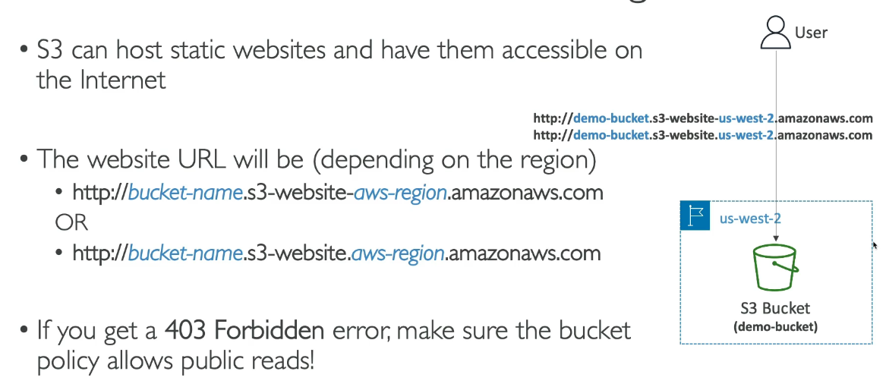
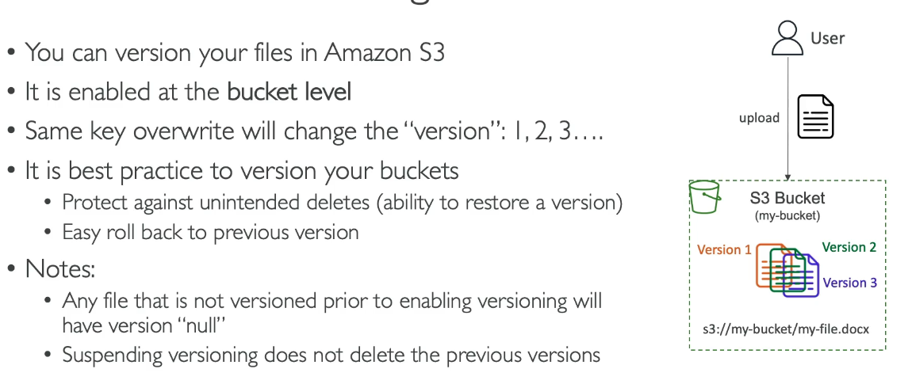

# S3: Static Website

# Steps: Host a Static Website

1. Create bucket and objects
2. Properties
3. Static Website Hosting>edit
4. Enable
5. Host a static website
6. Index doc: e.g. index.html
7. save
8. Properties>Static Website Hosting>Bucket Website Endpoint
9. Copy the URL and it should show your website

# Versioning

# Steps: Versioning the static website

1. In S3 bucket
2. Properties
3. Bucket Versioning>edit
4. enable

editing the html file...

1. Upload the html file on your computer
2. Re-upload it with the same name
3. It will have overwritten the original html file
4. If you click show versions you will see the previous version
5. If you delete the new verion the website will now have rolled back to the old version