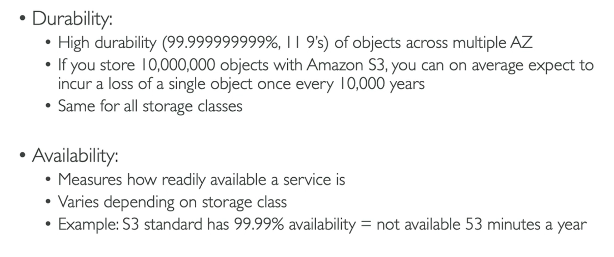
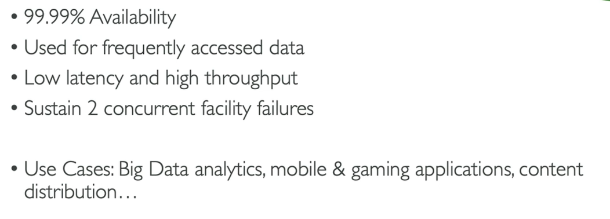
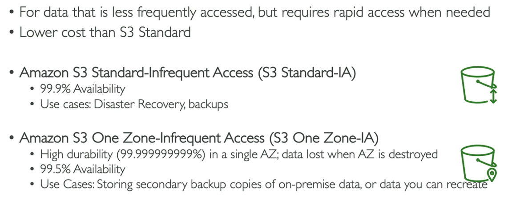
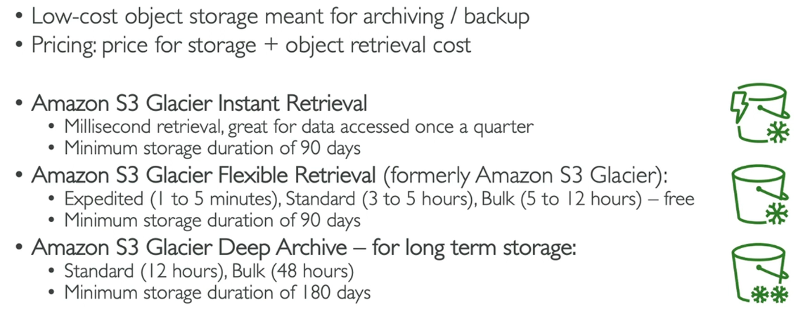
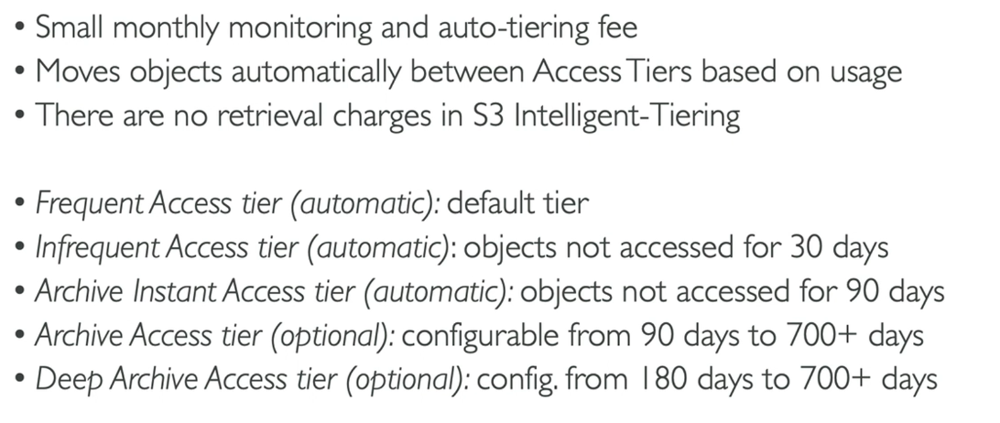

# S3: Storage Classes

- S3 has 7 storage classes
- An object can be moved between classes manually or using S3 Lifecycle configurations to move them automatically.

## Durability and Availibility

## S3 Standard - General Purpose

## S3 Storage Classes - Infrequent Access

## Glacier Storage Classes

## S3 Intelligent-Tiering

# Steps

1. Create bucket with object(s)
2. Go to the object you want
3. Properties
4. Shows the different storage classes available (standard is selected by default)

### Automation using Lifecycle configurations...

1. Go to bucket
2. Management
3. Lifecycle rules>Create lifecycle rule
4. Name
5. Apply to all objects in the bucket
6. Move current versions of objects between storage classes.
7. Select the storage classes and days after object creation
8. Create rule

