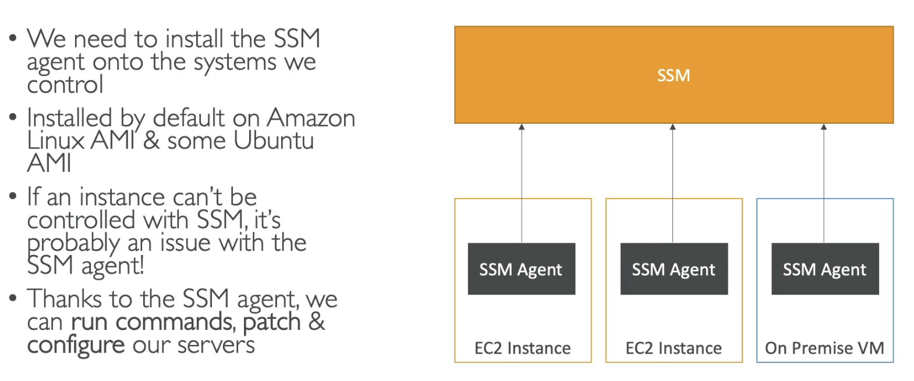
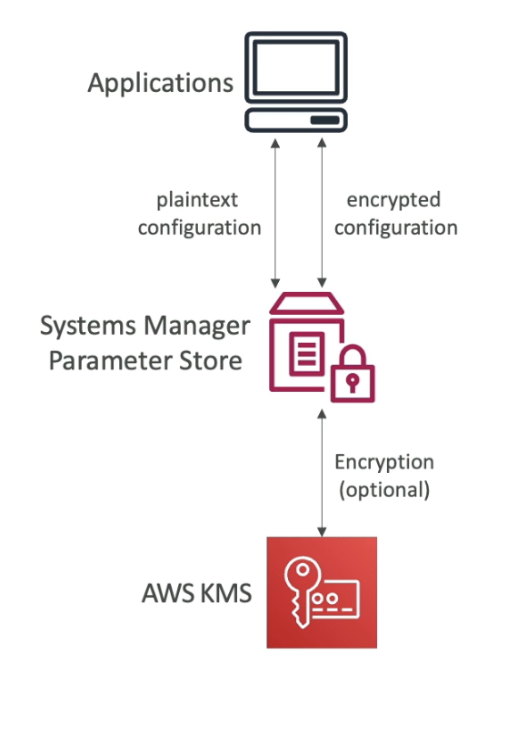

# AWS Systems Manager (SSM)

- Helps manage both your EC2 and On-Premises systems at scale (Hybrid service)
- Get operational insites on the state of your infrastructure
- Access to a Suite of 10+ products... e.g.
  - EC2 Instance/on-prem server patching automation for enhanced compliance
  - Run commands across an entire fleet of servers
  - Store parameter configuration with the SSM Parameter Store
- Works for many OS (Linux, MacOS)

## How it works

# SSM Session Manager

- Feature of SSM
- Allows you to start a secure shell on your EC2 and on-premises servers without SSH access, bastion hosts or SSH keys needed
- Therefore port 22 is not needed (better security)
- Supports many OS
- You can send session log data to S3 or CloudWatch Logs

- The EC2 instance with a SSM agent is connected to the Session Manager
- Users can access and execute commands on the instance through the Session manager

## Steps: Systems Manager

1. Launch an EC2 instance
   1. no key pair
   2. disable SSH traffic
   3. Attach an IAM instance profile (create role)
   4. AWS service
   5. EC2
   6. SSMManagedInstanceCore
   7. Add this to the instance
   8. launch instance
2. Systems Manager
3. Fleet Manager
4. Get started 
5. Should show your instance
6. Session manager
7. Start session on the instance
8. Secure shell is now created
9. Can do commands on the instance

# SSM Parameter Store

- A way to store configuration and secrets suecurely on AWS
- e.g. API Keys, passwords, configurations...
- Serverless, scalable, durable, easy to use
- It is secure as you controll access using IAM
- Version tracking and encryption (option)
  

# Steps: Parameter Store

1. Systems Manager
2. Parameter Store
3. Create Parameter
4. name
5. standard
6. Type e.g. String
   1. StringList = List of values
   2. Secure string = when you want to encrypt something e.g. API Key or password
7. Data Type e.g. text
8. Value
9. Create parameter
10. You can then just click on it and view the value.