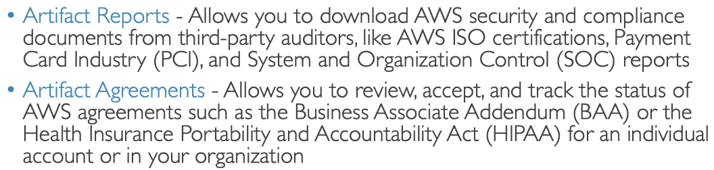

# Security and Compliance Services

# AWS Secrets Manager

- Stored 'secrets' e.g. passwords, API key
- Capability to force the rotation of secrets every X days, this can be automated using Lambda
- Integration with Amazon RDS (can create passwords for Amazon RDS)
- Secrets encrypted using KMS.

# AWS Artifact

- Not really a service, but presented as one by the console.
- A portal that provides customers with on-demand access to AWS compliance documentation and AWS agreements
- Can be used to support intenal audit or compliance.

