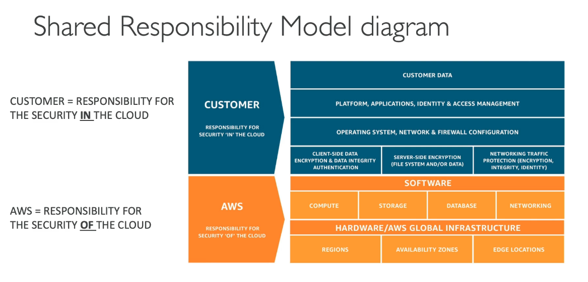

# Shared Responsibility Model

The shared Responsibility Model: The distribution of responsibilities from security in the AWS cloud. (You vs. AWS)

## AWS

- Infrastructure (global network security)
- Configuration and vulnerability analysis
- Compliance validation

## You

- Creating Users, Groups, Roles, Policies management and monitoring.
- Enable MFA on all accounts
- Rotate all your keys often 
- Use IAM tools to apply appropriate permissions
- Analyse access patterns and review permissions

They are responsible for all the infrastructure but we are responsible for how we use it.