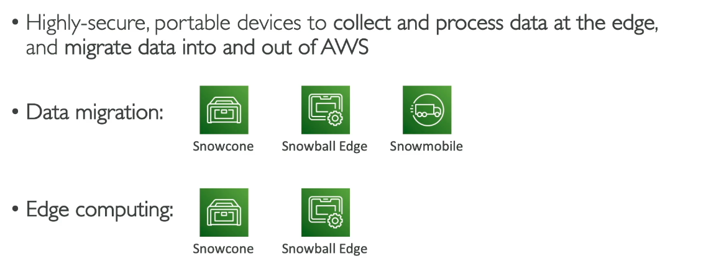
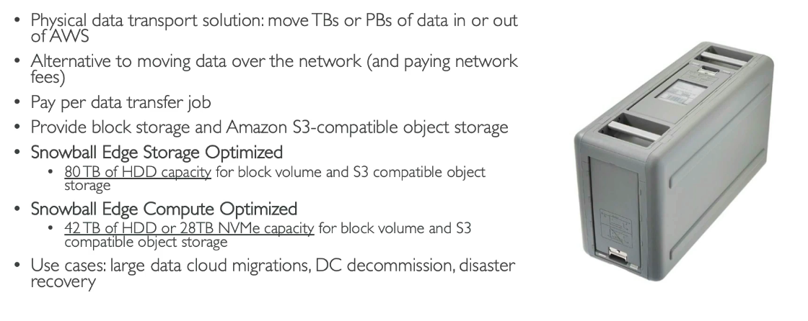
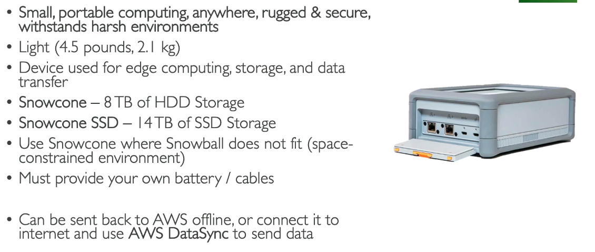
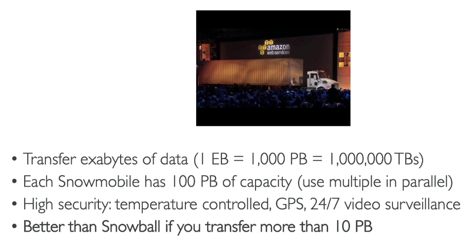
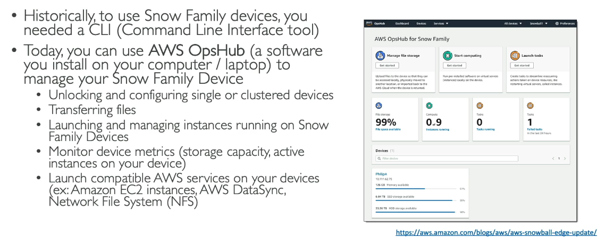
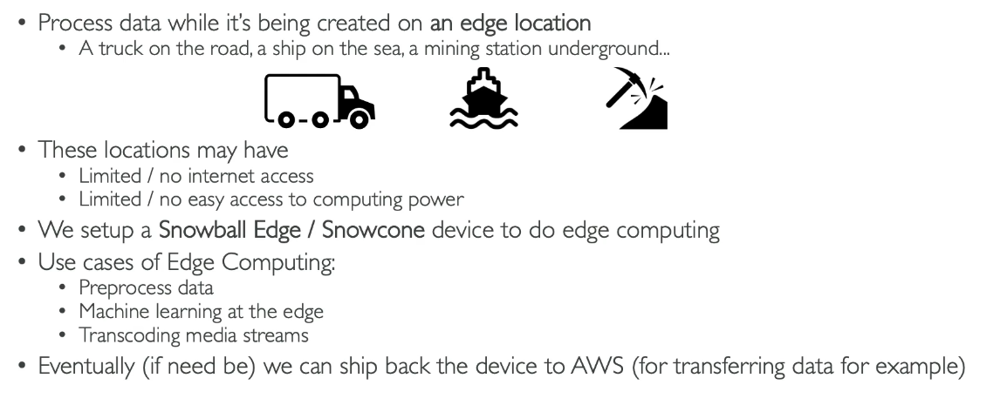
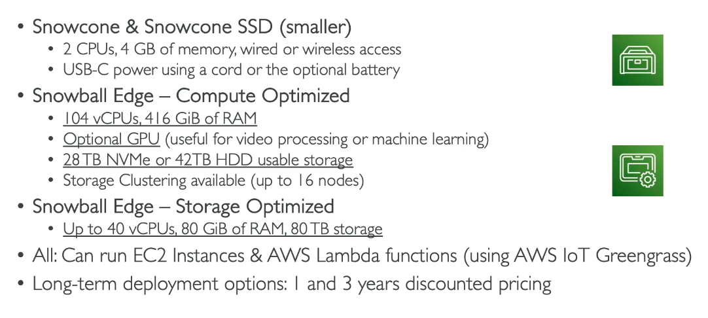
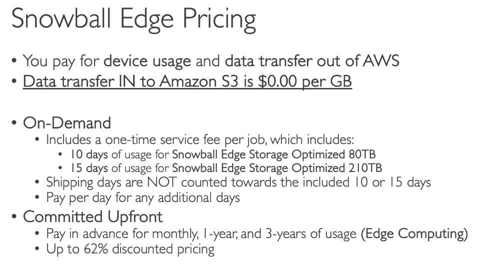

# AWS Snow Family

Challenges with Data Migration without Snow Family:
 - Limited connectivity
 - Limited bandwith
 - High network cost (money)
 - Shared bandwith (can't maximise the line)
 - Connection stability (keep having to retry)

It takes too long!

## AWS Snow Family

- Offline devices to perform data migrations
- If it takes more than a week to transfer over the network, user Snowball devices!

## Snowball Edge (for data transfers)

## Snowcone and Snowcone SSD

## Snowmobile

## AWS OpsHub

## Usage: Data Migration

1. Request a device from AWS console
2. Install the snowball client/AWS OpsHub on your servers
3. Connect snowball to your servers and copy files using the client
4. Ship back the device (goes to the right AWS facility)
5. They will then import/ export the data onto a S3 bucket within their own facility.
6. Snowball is completely wiped

## Usage: Edge Computing

 
### Snowcone = 8 TB of usable storage 

# Steps

1. AWS Snow Family
2. Order an AWS Snow Family device.
3. job name
4. Import into s3/ export from s3/ local compute and storage only/ import virtual tapes into AWS Storage Gateway
5. Next
6. Option of device types
7. Option of pricing options
8. Storage types options e.g. S3 data transfer
9. AMI type
10. Select the s3 bucket you want it to be loaded onto.
11. Remote device management
12. Encryption
13. Create service role to allow snow family access to use s3 and sns
14. Shipping address and speed
15. Sns notification options e.g. email address