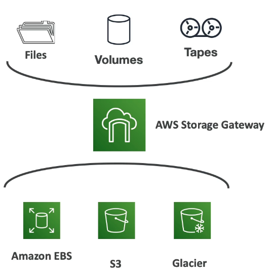

# AWS Storage Gateway

- A hybrid storage service thta allows on premises to seamlessly use the AWS Cloud.
- A bridge between on-premises data and cloud data in S3.
- Use Cases: disaster recovery, backup and restore, tiered storage

