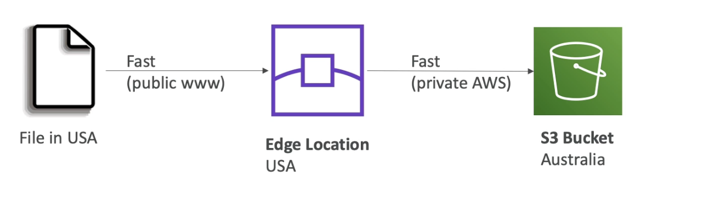
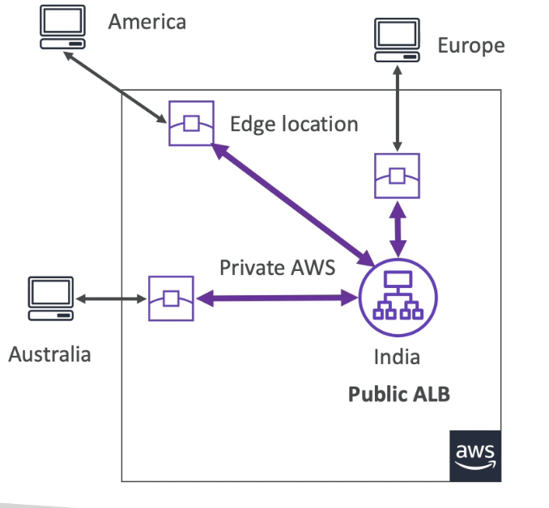
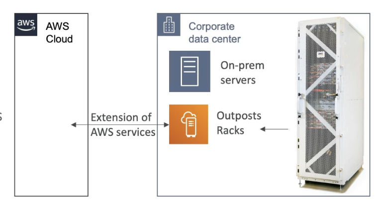
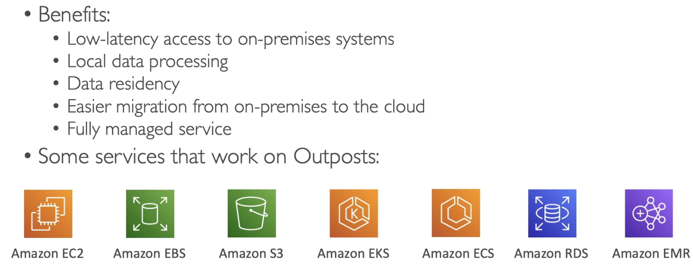
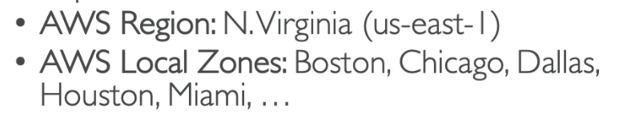
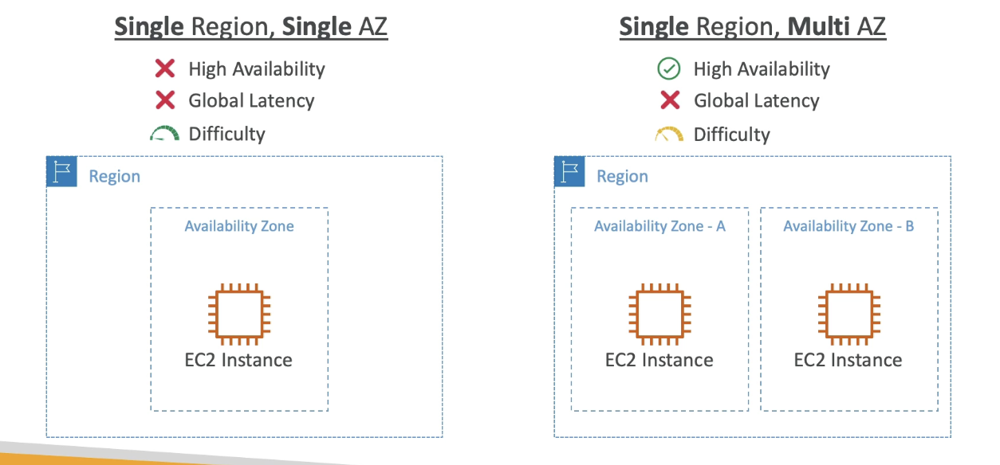
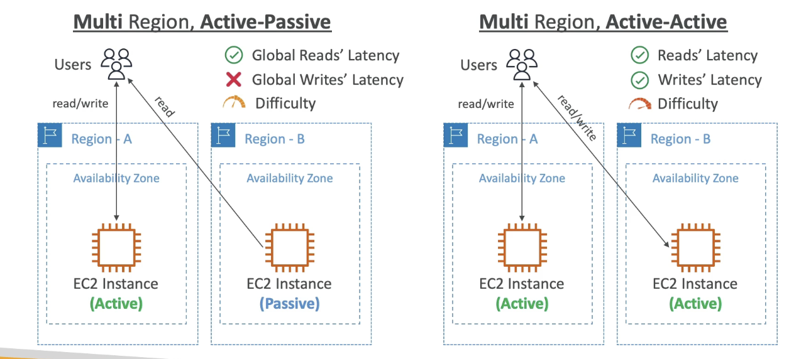

# Global Services 
# S3 Transfer Acceleration

- Increases the speed of transferring files from all around the world to one S3 bucket.
- Increases speed by transferring the files to an AWS edge loaction close to the user which will forward the data to the S3 bucket in the target location with a more reliable and faster connection.

# AWS Global Accelerator

- Improves the global application availibility and performance using the AWS global network
- Levereges the AWS internal network to optimise the route to your application (60% improvement)
- 2 Anycast IP are created for your application and traffic is sent through Edge Locations
- The Edge locations send the traffic to your application
- Private network is much faster, less issues and latency

# AWS Outposts

- AWS Outposts are server racks that offer the same AWS infrastructure, services, API's and tools to build your own apllications on-premises just as in the cloud.
- Good for businesses that use Hybrid Cloud model.
- They are responsible for the physical security.

## benefits

# AWS WaveLength

- Provides ultra-low latency application through 5G networks
- WaveLength Zones: infrastructure deployments embedded within the telecommunications providers' datacenters at the edge of the 5G networks.
- Brings AWS services to the edge of the 5G networks.
- Use cases: Smart cities, ML-assisted diagnostics, Connectived vehicles, Real-time Gaming

# AWS Local Zones

- Places AWS compute, storage, database and other selcted AWS services closer to end users to run latency-sensitive applications.
- You extend your AWS region/VPC to more Local Zones
  - Some regions don't have any local zones (different to AZ's)

# Steps

1. EC2
2. Zones
3. Manage the local zone you want
4. Enable
5. You can create subnets with that zone for your instances.

# Global Applications Architecture

