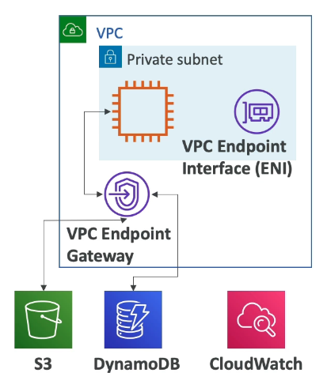
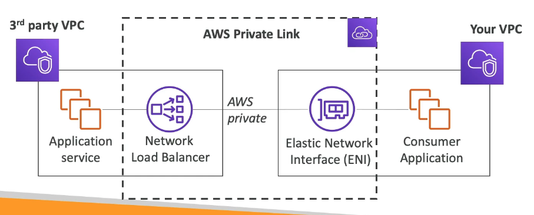
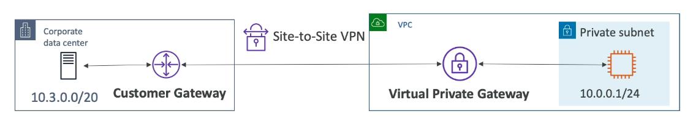
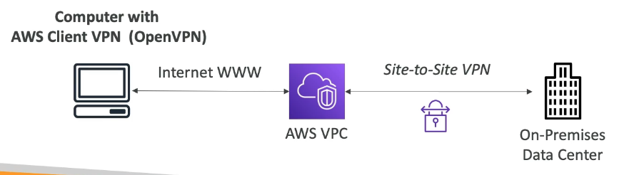
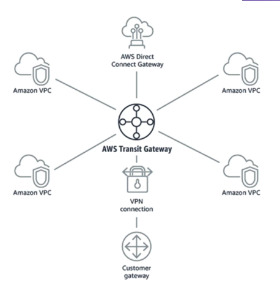

# VPC Services

# VPC Flow Logs

- They capture information about IP traffic going into your interfaces.
  - You can have VPC/Subnet/Elastic Network Interface Flow Logs
- Helps to monitor and troubleshoot connectivity issues e.g. subnets not connecting to other subnets/ internet
- Captures network information from AWS managed interfaces too e.g. Elastic load balancers, Aurora...
- The flow logs can go to S3, CloudWatch Logs and Kinesis Data Firehouse

# VPC Peering

- Connects two VPC's privatly using AWS's network, to make them behave as if they were on the same network.
- Must not have overlapping CIDR (IP address ranges).
- The connection is not transitive (If A and B, and B and C are connected A and C cannot communicate until they are also connected.)

# VPC Endpoints

- Allow you to connect to AWS Services using a private network unstead of the public internet network.
- Gives you better security and lower latency to access AWS services.
- VPC Endpoint Gateway: For connecting to S3 and DynamoDB (outside the private subnet)
- VPC Endpoint Interface: For connecting to the rest of the services (inside the private subnet)

# AWS PrivateLink (A VPC Endpoint Service)

- The most secure and scalable way to expose a service running within your VPC to 1000's of VPC's directly and privatly.
- Requires a network load balancer (ServiceVPC) and ENI (customerVPC)
- e.g. seller on the AWS maketplace wants to sell access to their application service...

# Hybrid Connection

- To connect your on-premises DC to your VPC

## Site to Site VPN

- Encrypted connection between on-prem DC and VPC that goes over the public internet.
- Fast to set up.
- Needs a Customer Gateway(CGW) on-prem.
- Needs a Virtual Private Gateway(VGW) on the AWS side.

## Direct Connect

- Private, secure and fast physical connection between on-prem DC and VPC that goes over the private network.
- Slower to set up.

# AWS Client VPN

- To privatly connect your computer to your private network in AWS or on-prem(if it has site to site VPN) using OpenVPN.
- Allows you to connect to your EC2 instances over a private IP (as if you were in the private VPC network)

# TRansit Gateway

- Service that allows you to have transitive peering between thousands of VPC and on-prem using a hub-and-spoke (star) connection.

