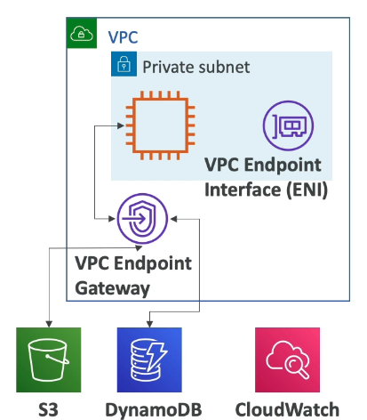

# VPC (Virtual Private Cloud)

- A private network to deploy your (regional) resources within.

- Subnets: allow you to partition your network inside your VPC and is within/associated with an availibility zone.
  -  Can be public (accessable from the internet) or private (not accessible)
  -  Can put instances, load balancers and databases in them
-  Route Tables: To define access to the internet and between subnets.
-  Internet Gateway: helps the VPC instances within public subnets to connect to the internet.
   -  Public subnets have a riute to the internet gateway
- NAT Gateways: allow your instances in private subnets access to the internet but not access from it. (remain private)
  - Built inside a public subnet and a route is built from the private subnet to the NAT, and from the NAT to the Internet Gateway
  - NAT Gateway(AWS Managed), NAT Instances (self-managed).
- NACL (Network ACL): A firewall which controls traffic from and to the subnet with ALLLOW and DENY rules for IP's
  - Return traffic must be explicitly allowed by rules (stateless)
- Security Groups: A firewall that controlls traffic to and from an ENI/ an EC2 Instance with ALLOW rules for IP's and other security groups
  - Return traffic is automatically allowed (stateful)

# IP Adresses

## IPv4

- Public IPv4 can be used on the internet
- Private IPv4 can be used within your own network
- An EC2 instance gets a new public IP address every time you stoop and start it, the private IP is fixed.

- Elastic IP: Allows you to attached a fixed public IPv4 address to an EC2 instance

## IPv6

- Only public addresses.

# VPC Flow Logs

- They capture information about IP traffic going into your interfaces.
  - You can have VPC/Subnet/Elastic Network Interface Flow Logs
- Helps to monitor and troubleshoot connectivity issues e.g. subnets not connecting to other subnets/ internet
- Captures network information from AWS managed interfaces too e.g. Elastic load balancers, Aurora...
- The flow logs can go to S3, CloudWatch Logs and Kinesis Data Firehouse

# VPC Peering

- Connects two VPC's privatly using AWS's network, to make them behave as if they were on the same network.
- Must not have overlapping CIDR (IP address ranges).
- The connection is not transitive (If A and B, and B and C are connected A and C cannot communicate until they are also connected.)

# VPC Endpoints

- Allow you to connect to AWS Services using a private network unstead of the public internet network.
- Gives you better security and lower latency to access AWS services.
- VPC Endpoint Gateway: For connecting to S3 and DynamoDB (outside the private subnet)
- VPC Endpoint Interface: For connecting to the rest of the services (inside the private subnet)

# AWS PrivateLink (A VPC Endpoint Service)

