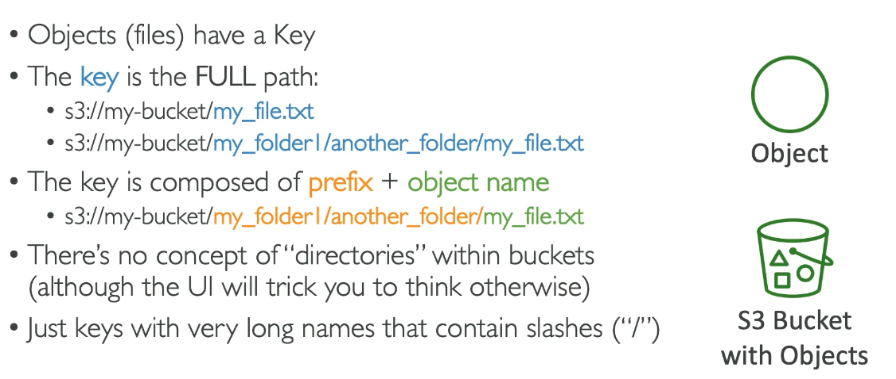
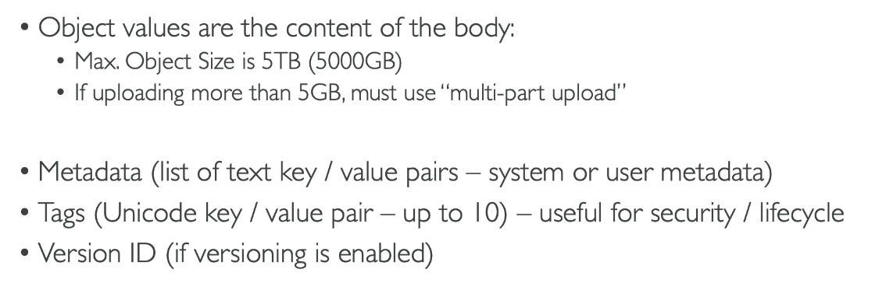

# Amazon S3

### Infinitely scaling storage

- Used by many wesbites as well as AWS services
- Backup and storage
- Disaster recovery
- Archive
- Hybrid cloud storage
- Application housing
- Media hosting
- Data lakes and big data analytics
- Software delivery
- Static website

## Buckets

- Users stored objects (files) into buckets (directories)
- Buckets must have a globally unique name.
- Buckets are defined at the region level.
- Have naming conventions e.g. no uppercase 

## Objects

# Steps: Create Bucket

1. S3
2. Buckets
3. Create Bucket
   
4. Unique name
5. Region
6. Disable ACL's
7. Block all public access
8. Bucket Versioning: disable
9. Leave default encryption settings
10. Create settings
11. You can now upload objects and create folders
